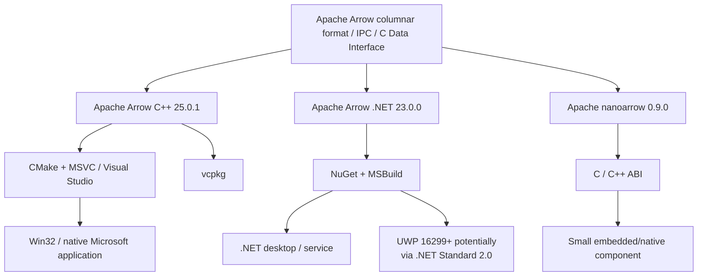
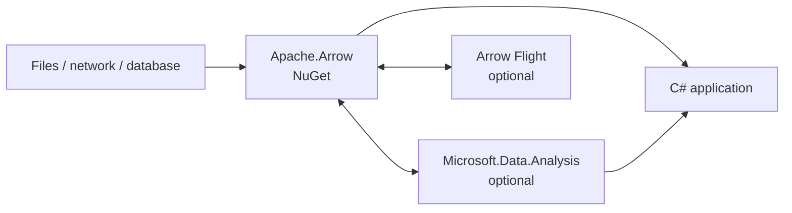

# Apache Arrow on Windows: Native Microsoft-Platform Support, Gaps, and Alternatives

## Executive summary

**Bottom line: Apache Arrow does have bona fide Windows-native implementations that can be embedded directly into ordinary Microsoft applications without Python. What does *not* exist is a separate Microsoft-owned, Windows-first Arrow fork or Windows-specific implementation.** The upstream Apache project itself supplies the relevant implementations:

| Question | Finding |
|---|---|
| Native C++/Win32? | **Yes.** Arrow C++ builds with CMake and MSVC/Visual Studio, produces ordinary native libraries, supports static or DLL linkage, and is available through vcpkg. [[1]](#ref-1)[[8]](#ref-8)[[9]](#ref-9) |
| Native C#/.NET? | **Yes.** `Apache.Arrow` is an official Apache C# implementation distributed on NuGet, with no Python or Arrow C++ runtime requirement for the core package. It targets .NET Standard 2.0, .NET 6, .NET 8 and .NET Framework 4.6.2. [[2]](#ref-2)[[10]](#ref-10) |
| MSBuild? | **Yes, indirectly/directly depending on language.** C++ uses CMake's Visual Studio generator, which generates a Visual Studio/MSBuild build; .NET uses normal SDK-style .NET/MSBuild tooling (`dotnet build`). Arrow does not use a Windows-only `.vcxproj` build as its canonical C++ build system. [[1]](#ref-1)[[S17]](#ref-s17) |
| vcpkg? | **Yes.** Arrow C++ 25.0.1 is in Microsoft's vcpkg, including feature-selectable Compute, Acero, Dataset, Flight, Parquet, S3, GCS and allocator support. Apache describes that port as maintained by Microsoft team members plus community contributors, although third-party package-manager artifacts are not formally Apache release artifacts. [[3]](#ref-3)[[9]](#ref-9) |
| NuGet? | **Yes.** Official Apache packages exist for core Arrow, compression and Flight-related .NET functionality. [[3]](#ref-3)[[10]](#ref-10)[[S8]](#ref-s8) |
| MSIX? | **No Arrow-provided MSIX SDK/package was found.** Apache's current installation matrix lists NuGet, vcpkg, Conan, MSYS2, conda and other channels, but no MSIX distribution. An application can of course place Arrow assemblies/DLLs inside its own MSIX. [[3]](#ref-3) |
| UWP? | **Possible for the managed library, but not a first-class Arrow target.** `Apache.Arrow` targets .NET Standard 2.0, and Microsoft says UWP Build 16299+ implements .NET Standard 2.0. Apache does not document or certify UWP specifically. Full Arrow C++ should not be assumed UWP-compatible without dependency-by-dependency validation. [[2]](#ref-2)[[34]](#ref-34)[[11]](#ref-11) |
| Windows-specific optimization? | **Some Windows adaptation, but mostly cross-platform optimization rather than Windows-specialized engineering.** Arrow has runtime x86 SIMD dispatch, aligned buffers, mimalloc/jemalloc memory pools, mmap, parallel I/O, MSVC-specific build fixes and Windows compatibility paths. It does not document a Windows-specific IOCP/I/O-ring/DirectStorage-style backend or Windows scheduler integration. [[4]](#ref-4)[[15]](#ref-15)[[14]](#ref-14)[[9]](#ref-9) |
| Windows vs Linux benchmark? | **No authoritative apples-to-apples Arrow benchmark was found.** Arrow provides an extensive benchmark harness, but its documented benchmark/Conbench infrastructure is predominantly Linux-based rather than a published matched Windows-vs-Linux comparison. [[5]](#ref-5)[[18]](#ref-18)[[S3]](#ref-s3) |

The most important architectural distinction is therefore:

> **Arrow on Windows is Windows-native, but not Windows-first.**

For a **C#/desktop Microsoft application whose principal requirement is interoperable Arrow memory and IPC**, the official `Apache.Arrow` NuGet package is the cleanest choice. For a **high-performance Win32/C++ analytical engine**, upstream Arrow C++ built through vcpkg/CMake/MSVC is the most complete option. For a **small C ABI or plug-in boundary**, Apache **nanoarrow** is especially attractive because its C runtime is only a few hundred kilobytes and can be vendored as essentially `nanoarrow.c` + `nanoarrow.h`. [[2]](#ref-2)[[8]](#ref-8)[[17]](#ref-17)

If the actual requirement is **local analytical querying rather than Arrow-format interchange**, **DuckDB** is the strongest alternative: it is an embedded native analytical database with a columnar-vectorized engine, an official Windows DLL, C API and excellent Arrow/ADBC interoperability. It is not, however, a substitute for Arrow's standardized in-memory buffer ABI. [[6]](#ref-6)[[26]](#ref-26)[[31]](#ref-31)

## What Apache Arrow actually provides on Windows

As of **August 27, 2026**, the current main Apache Arrow release is **25.0.1, released August 10, 2026**. It was published by the Apache Arrow PMC as a bug-fix release containing nine resolved issues across ten commits from six contributors. The project is governed and maintained by the Apache Arrow community/PMC, not Microsoft. [[7]](#ref-7)[[3]](#ref-3)

The project's official repository is [apache/arrow](https://github.com/apache/arrow), with current documentation at [arrow.apache.org/docs](https://arrow.apache.org/docs/) and installation information at [arrow.apache.org/install](https://arrow.apache.org/install/). [[3]](#ref-3)[[8]](#ref-8)

### Arrow C++ is a real native Windows library

The C++ implementation is not a wrapper around Python. Apache explicitly documents Windows development with **Visual Studio/MSVC**, Ninja, NMake, MSYS2, vcpkg and Windows-on-ARM64 experimentation. The documentation describes Windows as one of the platforms on which the project has worked to make CMake builds operate "out of the box" for a substantial subset of Arrow. [[1]](#ref-1)[[S10]](#ref-s10)

A conventional MSVC source build looks like:

```bat
cd arrow\cpp
mkdir build
cd build

cmake .. ^
  -G "Visual Studio 17 2022" ^
  -A x64 ^
  -DARROW_BUILD_TESTS=ON

cmake --build . --config Release
```

Apache's documentation shows the same procedure with Visual Studio generators and explicitly says newer Visual Studio versions can be selected by changing the generator. [[1]](#ref-1)

For consumption from another CMake/MSVC application, Arrow's supported model is equally conventional:

```cmake
cmake_minimum_required(VERSION 3.25)
project(MyWindowsApp LANGUAGES CXX)

find_package(Arrow REQUIRED)

add_executable(MyWindowsApp main.cpp)
target_link_libraries(MyWindowsApp PRIVATE Arrow::arrow_shared)
```

`Arrow::arrow_shared` and `Arrow::arrow_static` are official imported CMake targets; analogous CMake packages exist for Arrow Compute, Dataset, Flight, Parquet, Acero and other components. [[8]](#ref-8)

This means that from a Win32 application's perspective, Arrow is simply another native C++ dependency. There is no Python interpreter, Java VM, Node runtime or IPC proxy involved unless the application itself chooses to add one. The normal concerns are those of a large native C++ dependency graph: ABI/compiler consistency, CRT selection and static-versus-dynamic linkage of third-party libraries. Apache explicitly warns that mixing dependency versions or static/dynamic linkage models can cause ODR violations and crashes. [[8]](#ref-8)

### vcpkg gives it unusually good Microsoft-toolchain integration

Microsoft's vcpkg currently contains **Arrow 25.0.1**. The port exposes features including Compute, Acero, CSV, CUDA, Dataset, filesystem support, Flight, Flight SQL, GCS, JSON, ORC, Parquet, S3, jemalloc and mimalloc. Its dependency graph includes libraries such as Boost, Brotli, bzip2, gflags, LZ4, OpenSSL, RE2, Snappy, Thrift, utf8proc, xsimd, zlib and zstd. [[9]](#ref-9)[[S16]](#ref-s16)

A normal Visual Studio/vcpkg project can therefore start with:

```bat
vcpkg add port arrow
```

or classic mode:

```bat
vcpkg install arrow
```

Apache's own Windows development instructions additionally show its source-tree vcpkg manifest workflow:

```bat
vcpkg install ^
  --triplet x64-windows ^
  --x-manifest-root cpp ^
  --feature-flags=versions ^
  --clean-after-build
```

`x64-windows` produces dynamic dependencies by default; `x64-windows-static` selects static linkage. [[1]](#ref-1)

An important governance nuance is that Apache labels package-manager builds in its "Other Installers" section as technically **unofficial Apache releases**, because the PMC does not vote on each binary package. At the same time, Apache specifically says the Arrow vcpkg port is kept current by **Microsoft team members and community contributors**. That is probably the strongest basis for describing Arrow's Windows C++ support as *Microsoft-tooling-first-class*, even though Microsoft does not own the implementation. [[3]](#ref-3)

The vcpkg port itself contains Windows/MSVC-specific patches, including `0001-msvc-static-name.patch`, `0005-cmake-msvcruntime.patch` and a vcpkg mimalloc integration patch, which demonstrates actual Windows toolchain maintenance rather than merely "it happens to compile on Windows." [[9]](#ref-9)

### Apache Arrow .NET is a separate official implementation

The managed implementation is now maintained in the official [apache/arrow-dotnet](https://github.com/apache/arrow-dotnet) repository. Apache describes it directly as "**An implementation of Arrow targeting .NET**." The C++ monorepo and .NET implementation now have separate release cadences, which is why the current C++ release is 25.0.1 while the current `Apache.Arrow` NuGet package is **23.0.0**, released on NuGet on **May 6, 2026**. [[2]](#ref-2)[[20]](#ref-20)[[12]](#ref-12)

Current framework targets are:

**C# 11; .NET Standard 2.0; .NET 6.0; .NET 8.0; and .NET Framework 4.6.2.** [[2]](#ref-2)[[10]](#ref-10)

Installation is ordinary NuGet/MSBuild:

```bat
dotnet add package Apache.Arrow --version 23.0.0
dotnet build
```

or:

```xml
<PackageReference Include="Apache.Arrow" Version="23.0.0" />
```

The repository itself uses normal .NET tooling (`dotnet build`, `dotnet test`, `dotnet pack`), so this is a fully conventional Visual Studio/.NET dependency rather than a P/Invoke layer around Arrow C++. [[10]](#ref-10)[[S17]](#ref-s17)

The implementation supports Arrow arrays, schemas and record batches; Arrow IPC files and streams; asynchronous I/O; and optional compression. It uses `Span<T>`, `Memory<T>`, `MemoryManager<T>` and `System.Buffers`, with 64-byte-aligned Arrow allocations. [[2]](#ref-2)[[S9]](#ref-s9)

There are significant capability differences from Arrow C++, however. Apache's own feature page currently lists tensors, true large arrays above 2 GiB and some newer Arrow types/features as incomplete or unimplemented, and the .NET implementation currently lacks the C++ implementation's full generic compute/kernel layer. This makes it an excellent **Arrow interoperability and serialization library**, but not a feature-for-feature C# port of Arrow C++/Acero. [[2]](#ref-2)[[S18]](#ref-s18)

Compression is deliberately separated into `Apache.Arrow.Compression`; Flight and server support have separate `Apache.Arrow.Flight` and `Apache.Arrow.Flight.AspNetCore` packages. Flight 23.0.0 pulls the normal .NET gRPC and Protocol Buffers dependencies rather than Python components. [[3]](#ref-3)[[S8]](#ref-s8)

### UWP is a compatibility case, not a supported Arrow SKU

There is no dedicated `Apache.Arrow.UWP`, WinRT projection or UWP-specific Arrow SDK in the Apache distribution. Nevertheless, `Apache.Arrow` targets **.NET Standard 2.0**, while Microsoft states that **UWP 10.0.16299 and later supports .NET Standard 2.0** and that UWP projects using it must set Build 16299 or later as their minimum version. [[2]](#ref-2)[[34]](#ref-34)[[11]](#ref-11)

Therefore:

**Managed UWP:** technically plausible from the target-framework perspective, but it should be treated as an application qualification exercise rather than an Apache-guaranteed deployment configuration. Store restrictions, AOT behavior and particular dependency APIs still need validation. [[11]](#ref-11)[[2]](#ref-2)

**Native C++ UWP:** not something Apache's Windows documentation advertises as supported. Arrow's large dependency graph means conventional Win32/Desktop MSVC should be treated as the supported Windows baseline unless every selected vcpkg dependency has been validated for a UWP triplet. [[1]](#ref-1)[[9]](#ref-9)

By contrast, ordinary **Win32 desktop applications** are directly in Arrow C++'s normal MSVC build/usage model. [[1]](#ref-1)[[8]](#ref-8)

The relationship between the main options is:



The versions and packaging paths above reflect the current Apache, NuGet and vcpkg releases as of August 2026. [[3]](#ref-3)[[9]](#ref-9)[[10]](#ref-10)[[21]](#ref-21)

## Windows optimization, dependencies, and deployment characteristics

### SIMD and CPU execution

Arrow C++ has genuine hardware-oriented optimization, but it is **not Windows-specific**. On x86 it detects CPU capabilities at runtime and selects optimized code paths; the runtime SIMD ceiling can include SSE-family, AVX, AVX2 and AVX-512 paths, with `ARROW_USER_SIMD_LEVEL` available to restrict dispatch. Apache describes the default behavior as detecting the current CPU and choosing the best available execution path. [[4]](#ref-4)[[S14]](#ref-s14)

Arrow 25 also continued work on runtime dispatch beyond x86: the 25.0.0 release moved CPU capability detection to xsimd and added dynamic SVE dispatch for ARM64. That reinforces that SIMD engineering is architecture-oriented rather than a Windows-only optimization layer. [[12]](#ref-12)

On Windows/x86/x64 this still matters substantially: the same AVX2/AVX-512-optimized kernels can execute in a native MSVC-built process when compiled with the appropriate Arrow features. The vcpkg port includes `xsimd` as a dependency. [[4]](#ref-4)[[9]](#ref-9)

Windows-on-ARM is currently less mature. Apache documents ARM64 Windows builds through **Ninja + `clang-cl`**, while stating that MSVC could not yet be used for the Windows/ARM64 build because of compatibility issues in dependencies such as xsimd and Boost; Apache labels that configuration experimental and not as comprehensively exercised in CI. [[1]](#ref-1)

### Memory allocation

The native implementation follows Arrow's performance-oriented memory rules: buffers allocated through the Arrow C++ API are **64-byte aligned and padded** according to the memory specification. Its default `MemoryPool` selects mimalloc if compiled in, otherwise jemalloc if compiled in, otherwise the system allocator. Applications can override the choice through `ARROW_DEFAULT_MEMORY_POOL` and can supply custom memory pools. [[13]](#ref-13)[[S11]](#ref-s11)[[4]](#ref-4)

This is relevant to Windows because vcpkg exposes both `mimalloc` and `jemalloc` Arrow features and carries a vcpkg-specific mimalloc integration patch. It is nevertheless more accurate to call this **Windows-friendly allocator support** than a Windows-specialized allocator architecture: Arrow uses the same memory-pool abstraction cross-platform. [[9]](#ref-9)

The .NET implementation likewise maintains 64-byte alignment, but allocation is integrated with managed .NET memory abstractions. Apache warns that the default over-allocation strategy can be disproportionately expensive for very small buffers—a one-byte logical buffer may require up to a 64-byte backing allocation to satisfy alignment. [[2]](#ref-2)

### I/O and kernel integration

Arrow C++ has capable native I/O primitives: sequential streams, random-access files, parallel `ReadAt`, buffered and compressed I/O, memory-mapped files and zero-copy mmap reads. The filesystem abstraction supports local storage plus build-selectable cloud/filesystem backends. [[14]](#ref-14)[[S13]](#ref-s13)

The execution model uses separate CPU and I/O thread pools. On Linux, the default CPU pool can use process CPU affinity; on other systems it falls back to `std::thread::hardware_concurrency`. The I/O pool defaults to eight threads and is configurable through `ARROW_IO_THREADS` or the C++ API. [[15]](#ref-15)[[S12]](#ref-s12)

That detail is instructive: **Arrow is not using a documented Windows-specialized scheduler here.** I found no current Apache documentation describing an Arrow backend built around Windows IOCP, Windows Thread Pool APIs, Registered I/O, DirectStorage or a comparable Windows-specific kernel fast path. Instead, Arrow presents cross-platform C++ file/stream and threading abstractions with Windows compatibility code underneath. The absence of such a documented mechanism should be understood as a research finding, not proof that no individual internal system call is Windows-specific. [[15]](#ref-15)[[14]](#ref-14)

There *are* Windows-specific compatibility accommodations. For example, Arrow exposes Windows-specific timezone configuration in some Clang/libc++ configurations, and the vcpkg port carries explicit MSVC runtime/static-link naming fixes. These are platform-enablement measures rather than performance engines. [[16]](#ref-16)[[9]](#ref-9)

### Runtime footprint

For a **full shared Arrow C++ build**, application deployment may include Arrow DLLs plus DLLs for whichever third-party features were enabled. The vcpkg dependency list illustrates why a "build everything" Arrow distribution is considerably heavier than a simple serialization library. A static vcpkg triplet can consolidate much of this into the application's binaries, at the cost of binary size and the need to keep static-link compile definitions/configuration consistent. [[9]](#ref-9)[[1]](#ref-1)[[8]](#ref-8)

For **Apache.Arrow .NET**, the core runtime environment is the targeted .NET implementation plus normal managed NuGet dependencies; it does not require the Apache Arrow C++ DLL or Python. Adding Flight introduces gRPC/Protobuf dependencies, while IPC compression is a separately installed package. [[2]](#ref-2)[[10]](#ref-10)[[S8]](#ref-s8)

For minimal native embedding, **nanoarrow** is dramatically smaller: Apache says its C runtime compiles to only a few hundred kilobytes and distributes the basic C library as two files. It handles Arrow C Data, C Stream, C Device and Arrow IPC rather than reproducing Arrow C++'s entire analytical engine. [[17]](#ref-17)[[S7]](#ref-s7)

## Packaging, build systems, and support matrix

The practical support picture is:

| Microsoft scenario | Best-supported path | Assessment |
|---|---|---|
| C#/.NET desktop or service | `Apache.Arrow` NuGet | **First-class.** Official Apache NuGet package and normal MSBuild/.NET project integration. [[2]](#ref-2)[[10]](#ref-10) |
| C++/MSVC Win32 | Arrow C++ + CMake + vcpkg | **First-class native build path.** Apache explicitly documents Visual Studio/MSVC and Microsoft vcpkg. [[1]](#ref-1)[[3]](#ref-3) |
| Visual Studio/MSBuild C++ project | Consume a CMake/vcpkg Arrow build from VS/MSBuild | **Good, but CMake-centric.** CMake is Arrow's supported integration layer; Visual Studio's generator supplies the MSBuild solution/project layer. [[1]](#ref-1)[[8]](#ref-8) |
| UWP C# | `.NET Standard 2.0` asset | **Framework-compatible in principle for Build 16299+, not explicitly Arrow-certified.** [[2]](#ref-2)[[11]](#ref-11) |
| UWP C++ | No documented supported configuration | **Weak/uncertain.** Do not assume the full dependency graph is Store/UWP-compatible. [[1]](#ref-1)[[9]](#ref-9) |
| MSIX | Bundle the selected NuGet assemblies or native binaries in your app | **No Arrow-specific MSIX package.** Apache's current installer list contains no MSIX distribution. [[3]](#ref-3) |
| Small Win32 C/C++ component | nanoarrow | **Very attractive** for Arrow interchange when full Compute/Acero/Dataset functionality is unnecessary. [[17]](#ref-17)[[S6]](#ref-s6) |
| Windows ARM64 | Arrow C++ via Clang/Ninja; .NET subject to .NET runtime support | **Native C++ support is still explicitly experimental in Apache's Windows documentation, and MSVC is not the documented compiler path.** [[1]](#ref-1) |

### C++ source-build dependency workflow

Apache's source repository can use its own vcpkg manifest rather than manually locating Boost and the compression/networking libraries. Arrow's Windows instructions explicitly support this arrangement and also allow static or shared dependency selection. [[1]](#ref-1)

A reasonable Microsoft-oriented build pipeline is therefore:

```text
Visual Studio 2022
       |
       +-- CMake
       |     |
       |     +-- vcpkg toolchain / Arrow manifest
       |     |
       |     +-- Arrow C++ + selected features
       |
       +-- MSVC x64
       |
       +-- Your Win32 application
```

Once installed, the supported downstream CMake interface is `find_package(Arrow REQUIRED)` plus one or more imported targets such as `Arrow::arrow_shared`, `ArrowCompute::arrow_compute_shared` or their static counterparts. [[8]](#ref-8)

### .NET build and package split

For a typical application:

```bat
dotnet add package Apache.Arrow --version 23.0.0
```

For compressed Arrow IPC:

```bat
dotnet add package Apache.Arrow.Compression --version 23.0.0
```

For Arrow Flight:

```bat
dotnet add package Apache.Arrow.Flight --version 23.0.0
```

The Apache installation page lists the core, compression, Flight and Flight ASP.NET Core packages as Apache-provided NuGet distributions. [[3]](#ref-3)[[S8]](#ref-s8)

One architectural caveat is critical: installing `Apache.Arrow` does **not** give C# applications the full set of Arrow C++ compute kernels or Acero execution nodes. A C# application that wants the Arrow memory model **plus heavyweight local analytics** will often either use Microsoft.Data.Analysis above Arrow, invoke a native Arrow C++ component, or use an embedded engine such as DuckDB. [[2]](#ref-2)[[19]](#ref-19)

## Performance evidence on Windows versus Linux

There is strong evidence that Arrow is designed for performance on both systems, but **I did not find a current Apache-published matched-hardware Windows-vs-Linux benchmark from which a credible percentage difference could be quoted**.

Apache's C++ benchmark tooling is extensive. `archery benchmark run` executes the microbenchmark suites; `archery benchmark diff` compares builds/commits; custom CMake flags can be supplied to test matters such as SIMD configuration; and results can be exported to JSON. [[5]](#ref-5)[[S1]](#ref-s1)

That means an organization can perform a proper comparison along these lines:

```bat
archery benchmark run C:\arrow\cpp\release-build --output=windows.json
```

and on a matched Linux environment:

```bash
archery benchmark run /opt/arrow/cpp/release-build --output=linux.json
```

The two result sets should only be treated as an operating-system comparison when CPU model, memory configuration, Arrow commit, optimization level, allocator, SIMD ceiling, feature selection, compiler versions and benchmark data are controlled. Arrow's benchmark documentation itself emphasizes benchmark comparison and statistical regression detection rather than publishing a universal platform ranking. [[5]](#ref-5)[[S2]](#ref-s2)

The project's historical/current Conbench setup reinforces the lack of a ready-made Windows comparison. Its benchmark-environment documentation gives Ubuntu-based benchmark setup instructions, and a recent 2026 Apache Arrow Conbench report identifies performance hosts such as `amd64-c6a-4xlarge-linux` and `arm64-t4g-2xlarge-linux`, even though the broader CI workflow also runs ordinary Windows/MSVC jobs. In other words, Windows is tested as a supported build platform, but the visible standardized performance infrastructure is not an equivalent Windows/Linux benchmark matrix. [[18]](#ref-18)[[S3]](#ref-s3)

### What can reasonably be expected

There is no technical reason to expect Arrow's basic memory layout to become inherently slower merely because it is hosted in Windows: the Arrow buffers, 64-byte alignment and x86 SIMD dispatch model remain the same. But meaningful differences can arise from the compiler, allocator, filesystem implementation, thread scheduling and libraries selected at build time. This is an inference from Arrow's documented architecture rather than a claimed benchmark result. [[4]](#ref-4)[[15]](#ref-15)[[14]](#ref-14)[[S11]](#ref-s11)

One particularly relevant cross-platform difference is documented explicitly: Arrow can size its CPU thread pool from process CPU affinity on Linux, whereas the fallback used elsewhere is `std::thread::hardware_concurrency`. That does not imply Linux is faster, but it is a concrete example of why identical source code is not necessarily identically tuned by default across operating systems. [[15]](#ref-15)

For a performance-sensitive Windows product, I would therefore treat **"benchmark on our actual deployment machine" as mandatory** rather than importing Linux performance numbers.

## Windows-native alternatives and adjacent implementations

There is an important finding here: **there is no convincing Microsoft-specific non-Arrow format that provides the same combination of standardized, language-independent in-memory columnar buffers, zero-copy interchange and broad ecosystem support.**

The most credible Windows alternatives either:

1. remain implementations of the **Arrow format** itself, such as nanoarrow; or
2. solve the **analytics** side of the problem but use Arrow for interchange, such as DuckDB or Microsoft.Data.Analysis. [[17]](#ref-17)[[31]](#ref-31)[[24]](#ref-24)

### Comparison of practical candidates

| name | platform | language | packaging | Windows-optimization notes | performance | maturity | license |
|---|---|---|---|---|---|---|---|
| **[Apache Arrow C++](https://github.com/apache/arrow)** | Windows, Linux, macOS; Win32 desktop is a documented Windows path | C++ | vcpkg, Conan, MSYS2, source/CMake; no Arrow MSIX | MSVC/VS CMake builds, vcpkg MSVC patches; runtime x86 SIMD; mimalloc/jemalloc; mmap and threaded I/O. Optimizations are primarily cross-platform rather than Windows-only. [[1]](#ref-1)[[4]](#ref-4)[[9]](#ref-9) | Full Compute/Acero engine; official benchmark suites. No credible official matched Windows/Linux result found. [[19]](#ref-19)[[5]](#ref-5) | **Very high.** Flagship Arrow implementation; current 25.0.1 released Aug. 10, 2026. [[7]](#ref-7) | Apache-2.0. [[9]](#ref-9) |
| **[Apache Arrow .NET](https://github.com/apache/arrow-dotnet)** | .NET on Windows and other .NET platforms; UWP theoretically via netstandard2.0/Build 16299+ | C# 11 | Official NuGet; normal MSBuild/.NET; no Arrow MSIX | Uses `Span`, `Memory`, 64-byte alignment and async I/O; no documented Windows-only SIMD/kernel layer. [[2]](#ref-2) | Strong IPC/interchange; much less compute capability than C++ and no official Windows/Linux benchmark found. [[2]](#ref-2)[[S18]](#ref-s18) | **High for interchange, medium for analytics completeness.** Current NuGet 23.0.0, May 6, 2026. [[20]](#ref-20) | Apache-2.0. |
| **[Apache nanoarrow](https://github.com/apache/arrow-nanoarrow)** | Portable native C/C++; suitable for Windows native embedding | C with C++ usability | Vendored `.c/.h`, CMake, vcpkg; current Apache release 0.9.0 while vcpkg currently shows 0.8.0#2 | No Windows-specialized compute engine; extremely small dependency/ABI footprint makes it attractive for DLL/plugin boundaries. [[17]](#ref-17)[[22]](#ref-22) | Designed for low-overhead Arrow C Data/C Stream/IPC consumption rather than analytical kernels; C runtime is only a few hundred KB. [[17]](#ref-17) | **Medium-high and focused.** 0.9.0 released Aug. 14, 2026; 38 resolved issues from five contributors. [[21]](#ref-21) | Apache-2.0. [[22]](#ref-22) |
| **[Microsoft.Data.Analysis](https://www.nuget.org/packages/Microsoft.Data.Analysis/)** | .NET, particularly natural in Microsoft applications | C# | Microsoft-prefixed NuGet package; MSBuild/PackageReference | Managed .NET implementation; no special Windows kernel backend. Crucially, package itself depends on `Apache.Arrow`. [[23]](#ref-23) | Provides DataFrame sort/filter/group/join/elementwise operations and can wrap an Arrow `RecordBatch` without copying. No authoritative OS comparison located. [[24]](#ref-24) | **Medium.** Current stable package is 0.23.0; still 0.x and documented in the ML.NET API surface. [[23]](#ref-23)[[28]](#ref-28) | MIT via `dotnet/machinelearning`. [[25]](#ref-25) |
| **[DuckDB](https://duckdb.org/)** | Native Windows, Linux, macOS; official Windows DLL | C API; internal C++ API; community .NET provider | Official downloadable Windows native library; vcpkg; community `DuckDB.NET.*` NuGets | Visual Studio is DuckDB's recommended Windows compiler; requires MSVC Redistributable for official Windows native build. vcpkg explicitly marks its current DuckDB port `!uwp`. [[26]](#ref-26)[[33]](#ref-33) | Columnar-vectorized SQL engine; strong analytics orientation; zero-copy Arrow ADBC integration. Official benchmark suite/TPC tests, but not a replacement Arrow memory ABI. [[6]](#ref-6)[[31]](#ref-31)[[S5]](#ref-s5) | **Very high.** DuckDB describes itself as a stable/mature system with millions of CI test queries; current docs identify 1.5.5 as stable. [[6]](#ref-6)[[30]](#ref-30) | MIT, DuckDB Foundation. [[27]](#ref-27)[[6]](#ref-6) |

### Apache nanoarrow

Nanoarrow deserves special attention because it answers a slightly different version of the original question: *"What is the smallest truly native Arrow component I can compile directly into a Windows application?"*

Apache describes nanoarrow as helpers for **Arrow C Data, C Stream, C Device and serialized Arrow IPC**. Its C runtime compiles into a few hundred kilobytes, and the core is distributable as `nanoarrow.c` and `nanoarrow.h`. CMake is its officially supported development/build system. [[17]](#ref-17)[[S7]](#ref-s7)

A basic source build is simply:

```bat
mkdir build
cd build
cmake ..
cmake --build .
```

Apache also documents CMake `FetchContent` and vendoring/bundling approaches. [[17]](#ref-17)

Version **0.9.0 was released August 14, 2026**, adding, among other things, dictionary decoding to its IPC reader and reference-counted array/buffer support. The current vcpkg port is still **0.8.0#2**, so a project requiring 0.9.0 immediately should vendor/build Apache's release rather than assume vcpkg has caught up. [[21]](#ref-21)[[22]](#ref-22)

Its Arrow API parity is **high for the C interchange structures and increasingly strong for IPC, but intentionally low for compute/Acero/Dataset functionality**. That is a feature, not a defect, when the requirement is merely moving Arrow-compatible columnar buffers through a native Windows API boundary. [[17]](#ref-17)

For a Win32 DLL, COM component, native extension or C ABI shared between C# and C++, nanoarrow may actually be a better engineering fit than full Arrow C++.

### Microsoft.Data.Analysis

`Microsoft.Data.Analysis` is the closest Microsoft ecosystem library to a native managed DataFrame abstraction. Its `DataFrame` supports indexing, elementwise operations, filtering, grouping, joins and other tabular operations and implements ML.NET's `IDataView` interface. [[28]](#ref-28)[[24]](#ref-24)

But it is **not an independent competitor to Arrow as an interchange standard**. Its current NuGet package explicitly depends on `Apache.Arrow >= 14.0.2`, and the API can create a DataFrame around an `Apache.Arrow.RecordBatch` **without copying**. Its `ArrowStringDataFrameColumn` exposes buffers in Arrow format. [[23]](#ref-23)[[24]](#ref-24)[[S4]](#ref-s4)

So its API parity is:

- **Analytics/DataFrame operations:** better/more convenient than bare `Apache.Arrow` C# for many common transformations. [[24]](#ref-24)
- **Arrow IPC and cross-language data interchange:** not a replacement; it delegates the Arrow aspect to Apache.Arrow. [[23]](#ref-23)[[24]](#ref-24)
- **Windows specialization:** essentially none; its strength is native integration with the .NET/ML.NET ecosystem rather than Windows-specific CPU or kernel facilities. [[29]](#ref-29)[[24]](#ref-24)

The current package is **0.23.0**, targets .NET 8 and .NET Standard 2.0, and is part of the MIT-licensed `dotnet/machinelearning` codebase. [[23]](#ref-23)[[25]](#ref-25)

I would therefore use Microsoft.Data.Analysis **on top of Arrow**, not instead of it, when a C# application needs convenient local DataFrame manipulation.

### DuckDB

DuckDB is a much stronger alternative where "the same primary use case" means **fast local columnar analytics**, but a weaker alternative where it means **a standardized data interchange memory representation**.

DuckDB is an embedded, in-process analytical database. Its engine uses **columnar-vectorized execution**, processing batches of values together to reduce per-value overhead; the DuckDB Foundation specifically positions this design for OLAP workloads. [[6]](#ref-6)

Windows support is unequivocally native. DuckDB's documentation recommends the **Visual Studio compiler** on Windows, uses CMake directly, and distributes native Windows libraries; the official Windows build requires the Microsoft Visual C++ Redistributable at runtime. [[26]](#ref-26)

For application ABI stability, DuckDB recommends its **C API** rather than the C++ API because the latter is explicitly described as internal and not guaranteed stable. [[30]](#ref-30)

Arrow interoperability is unusually good. The DuckDB ADBC driver transfers query results using Arrow and documents **zero-copy integration between DuckDB and Arrow**. A Windows application can therefore use DuckDB as its local analytical execution engine while retaining Arrow as its interchange boundary. [[31]](#ref-31)

The .NET situation deserves qualification. `DuckDB.NET.Data` is a mature-looking ADO.NET provider on NuGet and version 1.5.5 added Arrow result streaming, but it is a **community package owned by Giorgi Dalakishvili**, not the official DuckDB Foundation Windows/.NET binding. Its package explicitly says it does not itself contain the native DuckDB library. [[32]](#ref-32)

The current Microsoft vcpkg DuckDB port is also behind the newest upstream release—vcpkg lists **1.4.4#1**—and explicitly declares `!uwp`, which makes DuckDB a poor choice for a hard UWP requirement. [[33]](#ref-33)

For desktop Win32 applications, however, **Arrow + DuckDB** is an excellent combination: Arrow remains the standardized buffer/IPC representation and DuckDB supplies the high-level vectorized SQL engine. [[31]](#ref-31)[[6]](#ref-6)

## Recommended Microsoft-app integration choices

### For a C# or modern .NET application

Use **official `Apache.Arrow` from NuGet as the canonical interchange layer**.

This provides the cleanest zero-Python Microsoft development experience: NuGet/PackageReference, Visual Studio/MSBuild, managed arrays and IPC, async stream support and no dependency on the Arrow C++ DLL for basic operation. [[2]](#ref-2)[[10]](#ref-10)

Add `Apache.Arrow.Compression` only when compressed IPC is needed, and the Flight packages when network transport is needed. [[3]](#ref-3)[[S8]](#ref-s8)

When significant DataFrame-style C# transformations are needed, layer **Microsoft.Data.Analysis** over it. The zero-copy `FromArrowRecordBatch` bridge makes this a coherent architecture rather than two competing memory models. [[24]](#ref-24)

A sensible architecture is:



This is the most Microsoft-native stack available while preserving genuine Arrow interoperability. [[2]](#ref-2)[[23]](#ref-23)[[24]](#ref-24)

### For a high-performance native C++/Win32 application

Use **Arrow C++ + vcpkg + CMake + MSVC x64**.

That is the path with the fullest Arrow functionality: Arrow arrays and IPC plus Compute, Dataset, Acero, Parquet, filesystem backends and Flight as required. Visual Studio builds are directly documented by Apache, while vcpkg provides the best Microsoft ecosystem dependency management. [[1]](#ref-1)[[8]](#ref-8)[[9]](#ref-9)

Prefer a **feature-minimized manifest** rather than enabling everything. Arrow's native dependency graph grows substantially when Flight, cloud filesystems, Parquet, compression codecs and other components are enabled. [[9]](#ref-9)

For shipping:

- Use `x64-windows` when DLL deployment is acceptable.
- Consider `x64-windows-static` when a self-contained binary is operationally preferable.
- Keep all Arrow/dependency CRT and linkage choices consistent.
- Benchmark mimalloc versus the default/system allocator in the actual application rather than assuming one allocator wins on Windows. [[1]](#ref-1)[[8]](#ref-8)[[S11]](#ref-s11)

### For a small native DLL, COM boundary, plug-in, or SDK

Use **Apache nanoarrow**, particularly when the objective is to exchange Arrow arrays rather than run the Arrow C++ compute engine.

Its tiny C footprint, stable C-oriented interfaces and ability to be vendored directly avoid the large transitive dependency tree of Arrow C++. It still speaks the canonical Arrow C Data/C Stream structures and IPC. [[17]](#ref-17)[[S6]](#ref-s6)

This is arguably the closest thing to a **minimal Windows-native Arrow runtime**, although Apache intentionally designs it as portable C rather than a Windows-specific library. Current projects should note the temporary package-version gap between upstream nanoarrow 0.9.0 and vcpkg 0.8.0#2. [[21]](#ref-21)[[22]](#ref-22)

### For an analytics-heavy desktop application

Use **Arrow as the interchange model and DuckDB as the analytical execution engine**.

This avoids reimplementing joins, grouping, aggregation and SQL planning in the application while retaining Arrow-compatible zero-copy boundaries. DuckDB's native Windows DLL and C interface make it an ordinary embedded Win32 dependency rather than a server or Python runtime. [[26]](#ref-26)[[6]](#ref-6)[[31]](#ref-31)

For C#, the community `DuckDB.NET` bindings can make this convenient, but applications with strict supply-chain/support requirements should explicitly account for the fact that those bindings are not maintained by the DuckDB Foundation itself. [[32]](#ref-32)

### For UWP

The least-risk path is **managed `Apache.Arrow` using its .NET Standard 2.0 asset**, with UWP Minimum Version 16299 or later, followed by explicit package/API testing. Microsoft's framework compatibility makes that route plausible; Apache itself does not advertise UWP as a tested Arrow platform. [[34]](#ref-34)[[11]](#ref-11)[[2]](#ref-2)

I would **not** select full Arrow C++ or DuckDB for a new UWP architecture without a proof-of-concept build. DuckDB's vcpkg port explicitly excludes UWP, while Arrow's native Windows documentation is aimed at normal Visual Studio/MSVC Windows builds rather than UWP. [[33]](#ref-33)[[1]](#ref-1)

### Overall recommendation

For Microsoft's mainstream application models, there is **no need to seek a third-party Windows port of Arrow**:

**C#/.NET → `Apache.Arrow` NuGet.**  
**Win32/C++ → upstream Arrow C++ through vcpkg + CMake/MSVC.**  
**Tiny native interchange component → Apache nanoarrow.**  
**Local SQL/vectorized analytics → Arrow + DuckDB.**

The only major reason to reject upstream Arrow on the grounds that it is "not Windows-native" would be based on a mistaken premise. Both the C++ and C# implementations execute natively in their respective Microsoft runtime/toolchain environments and require no Python. The legitimate reservations are different: **Arrow is Apache-governed rather than Microsoft-governed; C++ remains CMake-centric rather than MSBuild-native; UWP is not a dedicated target; there is no Arrow MSIX SDK; and most performance optimization is architecture/cross-platform optimization rather than explicit Windows-kernel specialization.** [[1]](#ref-1)[[2]](#ref-2)[[3]](#ref-3)[[4]](#ref-4)[[14]](#ref-14)

The official starting points are [Apache Arrow installation](https://arrow.apache.org/install/), [Arrow C++ Windows development](https://arrow.apache.org/docs/developers/cpp/windows.html), [Arrow C++ CMake integration](https://arrow.apache.org/docs/cpp/build_system.html), [Apache Arrow .NET](https://arrow.apache.org/dotnet/), [Apache Arrow .NET repository](https://github.com/apache/arrow-dotnet), [Apache.Arrow on NuGet](https://www.nuget.org/packages/Apache.Arrow/), [Arrow on vcpkg](https://vcpkg.io/en/package/arrow.html), [Apache nanoarrow](https://arrow.apache.org/nanoarrow/), [Microsoft.Data.Analysis](https://www.nuget.org/packages/Microsoft.Data.Analysis/), and [DuckDB](https://duckdb.org/). Current release/package data in this report was checked against those primary sources on August 27, 2026. [[3]](#ref-3)[[9]](#ref-9)[[10]](#ref-10)[[21]](#ref-21)[[23]](#ref-23)[[S15]](#ref-s15)

## Sources

Numbering matches the original report's Sources panel. Citation IDs are preserved verbatim, as are the source URLs recorded at research time - including where a newer URL now exists.

<a id="ref-1"></a>**[1]** `turn20search0` - [Developing on Windows — Apache Arrow v24.0.0](https://arrow.apache.org/docs/24.0/developers/cpp/windows.html)

<a id="ref-2"></a>**[2]** `turn18search0` - [Apache Arrow .NET | Apache Arrow .NET](https://arrow.apache.org/dotnet/)

<a id="ref-3"></a>**[3]** `turn23search0` - [Installation | Apache Arrow](https://arrow.apache.org/install/)

<a id="ref-4"></a>**[4]** `turn21search0` - [Environment Variables — Apache Arrow v25.0.1](https://arrow.apache.org/docs/cpp/env_vars.html)

<a id="ref-5"></a>**[5]** `turn14search0` - [Benchmarks — Apache Arrow v24.0.0](https://arrow.apache.org/docs/24.0/developers/benchmarks.html)

<a id="ref-6"></a>**[6]** `turn22search1` - [Why DuckDB – DuckDB](https://duckdb.org/why_duckdb)

<a id="ref-7"></a>**[7]** `turn17search11` - [Apache Arrow 25.0.1 Release | Apache Arrow](https://arrow.apache.org/blog/2026/08/10/25.0.1-release/)

<a id="ref-8"></a>**[8]** `turn20search1` - [Using Arrow C++ in your own project — Apache Arrow v25.0.1](https://arrow.apache.org/docs/cpp/build_system.html)

<a id="ref-9"></a>**[9]** `turn23search1` - [vcpkg package - arrow](https://vcpkg.io/en/package/arrow)

<a id="ref-10"></a>**[10]** `turn18search1` - [NuGet Gallery | Apache.Arrow 23.0.0](https://www.nuget.org/packages/Apache.Arrow/23.0.0)

<a id="ref-11"></a>**[11]** `turn23search8` - [Choose a UWP version - UWP applications | Microsoft Learn](https://learn.microsoft.com/en-us/windows/uwp/updates-and-versions/choose-a-uwp-version)

<a id="ref-12"></a>**[12]** `turn1search0` - [Apache Arrow 25.0.0 Release | Apache Arrow](https://arrow.apache.org/blog/2026/07/10/25.0.0-release/)

<a id="ref-13"></a>**[13]** `turn20search3` - [Memory Management — Apache Arrow v22.0.0](https://arrow.apache.org/docs/22.0/cpp/memory.html)

<a id="ref-14"></a>**[14]** `turn21search2` - [Input / output and filesystems — Apache Arrow v25.0.1](https://arrow.apache.org/docs/cpp/io.html)

<a id="ref-15"></a>**[15]** `turn21search1` - [Thread Management — Apache Arrow v25.0.1](https://arrow.apache.org/docs/cpp/threading.html)

<a id="ref-16"></a>**[16]** `turn20search2` - [Programming Support — Apache Arrow v24.0.0](https://arrow.apache.org/docs/24.0/cpp/api/support.html)

<a id="ref-17"></a>**[17]** `turn17search0` - [nanoarrow — nanoarrow documentation](https://arrow.apache.org/nanoarrow/main/index.html)

<a id="ref-18"></a>**[18]** `turn14search7` - [Check level range in decoder · apache/arrow@283f56b · GitHub](https://github.com/apache/arrow/runs/90326448254)

<a id="ref-19"></a>**[19]** `turn21search6` - [User Guide — Apache Arrow v25.0.1](https://arrow.apache.org/docs/cpp/user_guide.html)

<a id="ref-20"></a>**[20]** `turn18search7` - [NuGet Gallery | Apache.Arrow 2.0.0](https://www.nuget.org/packages/Apache.Arrow/2.0.0)

<a id="ref-21"></a>**[21]** `turn17search3` - [Apache Arrow nanoarrow 0.9.0 Release | Apache Arrow](https://arrow.apache.org/blog/2026/08/14/nanoarrow-0.9.0-release/)

<a id="ref-22"></a>**[22]** `turn23search5` - [vcpkg package - nanoarrow](https://vcpkg.io/en/package/nanoarrow.html)

<a id="ref-23"></a>**[23]** `turn15search1` - [NuGet Gallery | Microsoft.Data.Analysis 0.23.0](https://www.nuget.org/packages/Microsoft.Data.Analysis/)

<a id="ref-24"></a>**[24]** `turn15search4` - [DataFrame Class (Microsoft.Data.Analysis) | Microsoft Learn](https://learn.microsoft.com/en-us/dotnet/api/microsoft.data.analysis.dataframe?view=ml-dotnet-preview)

<a id="ref-25"></a>**[25]** `turn15search2` - [machinelearning/LICENSE at main · dotnet/machinelearning · GitHub](https://github.com/dotnet/machinelearning/blob/main/LICENSE)

<a id="ref-26"></a>**[26]** `turn16search0` - [Windows – DuckDB](https://duckdb.org/docs/lts/dev/building/windows)

<a id="ref-27"></a>**[27]** `turn22search2` - [duckdb/LICENSE at main · duckdb/duckdb · GitHub](https://github.com/duckdb/duckdb/blob/master/LICENSE)

<a id="ref-28"></a>**[28]** `turn15search0` - [Microsoft.Data.Analysis Namespace | Microsoft Learn](https://learn.microsoft.com/en-us/dotnet/api/microsoft.data.analysis?view=ml-dotnet-preview)

<a id="ref-29"></a>**[29]** `turn15search3` - [IDataView Interface (Microsoft.ML) | Microsoft Learn](https://learn.microsoft.com/en-us/dotnet/api/microsoft.ml.idataview?view=ml-dotnet-preview)

<a id="ref-30"></a>**[30]** `turn16search1` - [C++ API – DuckDB](https://duckdb.org/docs/current/clients/cpp)

<a id="ref-31"></a>**[31]** `turn22search8` - [ADBC Client – DuckDB](https://duckdb.org/docs/lts/clients/adbc)

<a id="ref-32"></a>**[32]** `turn16search3` - [NuGet Gallery | DuckDB.NET.Data 1.5.5](https://www.nuget.org/packages/DuckDB.NET.Data/1.5.5)

<a id="ref-33"></a>**[33]** `turn16search2` - [vcpkg package - duckdb](https://vcpkg.io/en/package/duckdb.html)

<a id="ref-34"></a>**[34]** `turn23search6` - [What's new in .NET Standard - .NET | Microsoft Learn](https://learn.microsoft.com/en-us/dotnet/standard/whats-new/whats-new-in-dotnet-standard)

### Supporting references

Additional references attached to grouped inline citations in the underlying report object. These did not appear as separate numbered cards in the Sources panel.

<a id="ref-s1"></a>**[S1]** `turn14search3` - [Benchmarks — Apache Arrow v26.0.0.dev50](https://arrow.apache.org/docs/dev/developers/benchmarks.html)

<a id="ref-s2"></a>**[S2]** `turn14search6` - [Benchmarks — Apache Arrow v23.0.1](https://arrow.apache.org/docs/23.0/developers/benchmarks.html)

<a id="ref-s3"></a>**[S3]** `turn14search9` - [arrow/dev/conbench_envs/README.md at main · apache/arrow · GitHub](https://github.com/apache/arrow/blob/main/dev/conbench_envs/README.md)

<a id="ref-s4"></a>**[S4]** `turn15search8` - [ArrowStringDataFrameColumn Class (Microsoft.Data.Analysis) | Microsoft Learn](https://learn.microsoft.com/en-us/dotnet/api/microsoft.data.analysis.arrowstringdataframecolumn?view=ml-dotnet-preview)

<a id="ref-s5"></a>**[S5]** `turn16search4` - [Benchmark Suite – DuckDB](https://duckdb.org/docs/current/dev/benchmark)

<a id="ref-s6"></a>**[S6]** `turn17search12` - [Getting started with nanoarrow in C/C++ — nanoarrow documentation](https://arrow.apache.org/nanoarrow/latest/getting-started/cpp.html)

<a id="ref-s7"></a>**[S7]** `turn17search8` - [nanoarrow — nanoarrow documentation](https://arrow.apache.org/nanoarrow/latest/index.html)

<a id="ref-s8"></a>**[S8]** `turn18search2` - [NuGet Gallery | Apache.Arrow.Flight 23.0.0](https://www.nuget.org/packages/Apache.Arrow.Flight/23.0.0)

<a id="ref-s9"></a>**[S9]** `turn18search3` - [Apache Arrow .NET | Apache Arrow .NET](https://arrow.apache.org/dotnet/main/index.html)

<a id="ref-s10"></a>**[S10]** `turn20search8` - [Developing on Windows — Apache Arrow v11.0.0](https://arrow.apache.org/docs/11.0/developers/cpp/windows.html)

<a id="ref-s11"></a>**[S11]** `turn21search10` - [Memory Management — Apache Arrow v25.0.1](https://arrow.apache.org/docs/cpp/memory.html)

<a id="ref-s12"></a>**[S12]** `turn21search4` - [Thread (management) — Apache Arrow v25.0.1](https://arrow.apache.org/docs/cpp/api/thread.html)

<a id="ref-s13"></a>**[S13]** `turn21search5` - [Input / output — Apache Arrow v25.0.0](https://arrow.apache.org/docs/cpp/api/io.html)

<a id="ref-s14"></a>**[S14]** `turn21search8` - [Programming Support — Apache Arrow v25.0.1](https://arrow.apache.org/docs/cpp/api/support.html)

<a id="ref-s15"></a>**[S15]** `turn22search9` - [DuckDB – An in-process SQL OLAP database management system](https://duckdb.org/)

<a id="ref-s16"></a>**[S16]** `turn23search3` - [vcpkg package - arrow](https://vcpkg.io/en/package/arrow.html)

<a id="ref-s17"></a>**[S17]** `turn2search6` - [arrow-dotnet/README.md at main · apache/arrow-dotnet · GitHub](https://github.com/apache/arrow-dotnet/blob/main/README.md)

<a id="ref-s18"></a>**[S18]** `turn7view2` - [Apache Arrow .NET | Apache Arrow .NET](https://arrow.apache.org/dotnet/main/index.html)
