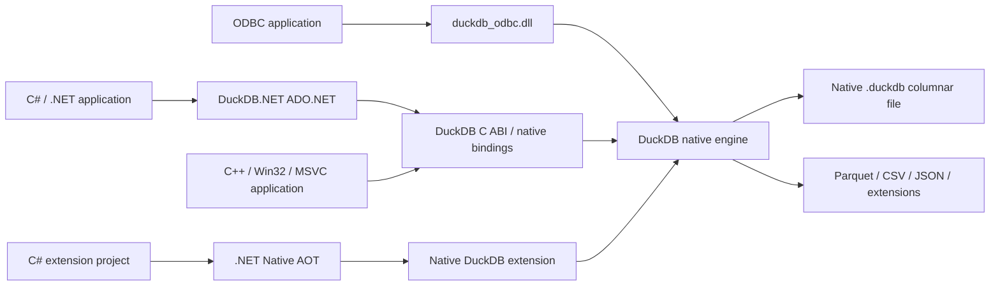

# DuckDB as a Windows-Native Embedded Analytics Stack

## Executive summary

**Bottom line:** **yes—DuckDB is already a native Windows embeddable database library, not merely a Python package that happens to run on Windows.** Windows is a fully supported DuckDB platform, including x86-64 and ARM64, and the project explicitly recommends the Visual Studio/MSVC compiler for Windows builds. For native applications, DuckDB exposes a **core-team-maintained, Primary-support C API** and distributes `libduckdb` binaries; the Windows documentation shows a native package containing a DLL, import library, and C/C++ headers. DuckDB's CMake build also defines both shared and static library targets. None of this requires Python at application runtime. [[1]](#ref-1)[[3]](#ref-3)[[6]](#ref-6)[[36]](#ref-36)

For **C#/.NET**, the answer is also substantially yes. **DuckDB.NET** provides an idiomatic ADO.NET provider plus low-level bindings, and its “Full” NuGet packages bundle the native DuckDB library. DuckDB's own current client-support matrix recognizes C#/.NET as an official **Secondary-tier client**, at version 1.5.5, maintained by Giorgi Dalakishvili; Secondary means it receives new features but is not covered by the same community-support guarantee as Primary clients. Thus DuckDB.NET has become considerably more first-class than an arbitrary third-party P/Invoke wrapper, although it is still not a core-team Primary client. [[2]](#ref-2)[[7]](#ref-7)[[S14]](#ref-s14)

There is one important qualification to “no Python.” **Consuming a prebuilt DuckDB Windows DLL or the full DuckDB.NET NuGet package requires no Python.** However, the current canonical DuckDB Windows source-build recipe for Visual Studio invokes a Python helper, `scripts/windows_ci.py`, around CMake. The general build system itself is CMake/C++, but a *strictly Python-free, officially documented, release-equivalent source-build recipe for MSVC* is not presently documented. The optional amalgamation generator also runs through Python and is explicitly best-effort/unsupported. [[3]](#ref-3)[[1]](#ref-1)

I found **no first-class DuckDB WinRT component, COM server, UWP-specific library, Windows App SDK projection, MSIX/Store-specific SDK, or NuGet package targeting those APIs as a distinct integration layer** in the current DuckDB client matrix, Windows build documentation, DuckDB.NET documentation, or official Windows ODBC documentation. Consequently, WinRT/UWP/Store certification and packaging should be treated as **unspecified**, not as supported merely because ordinary Win32/.NET binaries work on Windows. [[2]](#ref-2)[[3]](#ref-3)[[7]](#ref-7)[[10]](#ref-10)

The Windows performance story is strong at the engine level but **not specially Windows-optimized in a way the primary documentation exposes**. DuckDB uses vectorized, multithreaded analytical execution, compressed columnar storage, adaptive memory management, and out-of-core spilling. Conversely, its optional/current jemalloc integration is **not available on Windows**, and the official build documentation says `-march=native` is not supported. I found no current primary-source Windows-vs-Linux benchmark, MSVC-vs-Clang benchmark, or documented Windows-specific SIMD dispatch policy; therefore the exact SIMD code-generation strategy of official MSVC builds should be recorded as **unspecified**. [[4]](#ref-4)[[14]](#ref-14)[[1]](#ref-1)[[12]](#ref-12)

For DuckDB's *exact* use case—**an in-process, embeddable, columnar analytical SQL database**—I did **not** find a Microsoft-authored or Windows-first alternative that is clearly superior overall. Apache DataFusion is a genuine high-performance embedded analytical query-engine peer but is Rust-first, lacks an equivalent persistent transactional database format, and has no comparable first-class .NET/ADO.NET integration. ClickHouse's chDB is another genuine in-process OLAP peer with C/C++ APIs, but current Windows guidance still points to WSL rather than a native Windows build. Microsoft.Data.Sqlite/SQLite has arguably the best pure Microsoft/.NET embedding story but is a row-oriented transactional engine rather than an OLAP column store. SQL Server Express LocalDB is extremely Windows-native and supports the SQL Server analytical ecosystem, but it starts a SQL Server Database Engine process rather than linking an analytical engine into the application, and Express has severe CPU/memory/parallel batch-mode limits relative to DuckDB's intended use. [[5]](#ref-5)[[25]](#ref-25)[[24]](#ref-24)[[28]](#ref-28)[[27]](#ref-27)[[32]](#ref-32)[[34]](#ref-34)

| Question | Finding |
|---|---|
| Native Windows DuckDB engine? | **Yes; full-support Windows platform, x86-64 and ARM64.** [[1]](#ref-1) |
| Native DLL usable from MSVC/Win32? | **Yes.** Official Windows package/docs expose DLL, `.lib`, and headers. [[3]](#ref-3)[[36]](#ref-36) |
| Static library? | **Yes when building from source:** DuckDB's CMake install targets include `duckdb_static`; whether every Windows release provides a prebuilt static `.lib` separately is **unspecified**. [[6]](#ref-6) |
| Idiomatic .NET package? | **Yes:** DuckDB.NET ADO.NET plus low-level bindings; Full packages include native DuckDB. [[7]](#ref-7)[[S14]](#ref-s14) |
| Official .NET status? | **Secondary DuckDB client**, not Primary; receives features but lacks Primary community-support guarantee. [[2]](#ref-2) |
| Python needed at runtime? | **No.** Native/C++ and full .NET packaging embed/load the native engine directly. [[7]](#ref-7)[[3]](#ref-3) |
| Python needed to build from source? | **Canonical Windows recipe currently uses a Python build helper; strictly Python-free supported recipe is unspecified.** [[3]](#ref-3)[[1]](#ref-1) |
| Visual Studio/MSVC supported? | **Yes; recommended Windows compiler.** [[3]](#ref-3) |
| UWP/WinRT/COM/Store SDK? | **No dedicated supported component found; compatibility/certification unspecified.** [[2]](#ref-2)[[10]](#ref-10) |
| Best true DuckDB-equivalent on Windows? | **DuckDB itself.** The serious peers either lose native Windows/.NET integration or cease to be true in-process columnar OLAP databases. [[5]](#ref-5)[[25]](#ref-25)[[S10]](#ref-s10) |

## DuckDB’s Windows-native status

DuckDB describes itself as an **in-process analytical SQL database**, and Windows is not categorized as a compatibility or experimental target: the current build matrix lists Windows x86-64 and ARM64 among fully supported platforms, with stable and preview builds available. In contrast, MinGW Windows variants are only best-effort/compatibility platforms; MSVC is the recommended Windows toolchain. [[1]](#ref-1)[[3]](#ref-3)

### Native C and C++ integration

The most robust native Windows integration is the **DuckDB C API**. DuckDB's own client matrix gives C **Primary** status, and the C API is deliberately modeled somewhat after SQLite's C interface. Applications include `duckdb.h`, open either an in-memory or file-backed database, create connections, prepare statements, append vectors/data chunks, and consume results without a separate server. That is the interface I would use for a long-lived Win32 or MSVC product even when the host application itself is C++. [[2]](#ref-2)[[36]](#ref-36)

The project also has a C++ API, but the documentation has historically warned that it is an internal/native API whose compatibility is less stable than the C ABI. The current client matrix classifies C++ as **Secondary**, while C remains Primary. In practical Windows application architecture, therefore, a C++ application can link natively but should prefer the C API as its binary-stability boundary unless it explicitly accepts C++ API churn. [[2]](#ref-2)[[S1]](#ref-s1)

The official Windows build documentation gives a particularly concrete indication of native packaging: its Windows `libduckdb` example tells developers to obtain a package containing **`.dll`, `.lib`, `.hpp`, and `.h`** artifacts. DuckDB's CMake files define a shared `duckdb` target as well as `duckdb_static`, and both are installation targets. This means a conventional Visual C++ application can either deploy `duckdb.dll` beside the application or build/link DuckDB statically from source. The retrieved documentation does not establish that the `.lib` shipped in every binary ZIP is a self-contained static library—on Windows it normally accompanies the DLL as an import library—so the safe conclusion is: **prebuilt DLL + import library is explicitly documented; static linking is explicitly supported from the CMake source build.** [[3]](#ref-3)[[6]](#ref-6)

### C# and .NET

The .NET path is unusually good for a database that did not originate in the Microsoft ecosystem. **DuckDB.NET** supplies both low-level DuckDB bindings and an **ADO.NET provider**, with the latter documented as the recommended C# interface. Its package model separates managed-only packages from “Full” packages; `DuckDB.NET.Data.Full` combines the ADO.NET provider and native DuckDB library, while `DuckDB.NET.Bindings.Full` supplies the low-level binding plus the native engine. Therefore the common Visual Studio experience is essentially “add NuGet package, open `DuckDBConnection`, execute SQL.” No Python, JVM, Node runtime, Rust runtime, or local DuckDB server is needed. [[7]](#ref-7)[[S13]](#ref-s13)

This is more than a random community wrapper: DuckDB's own 2026 client page lists **C# (.NET), maintainer Giorgi, Secondary, version 1.5.5**. DuckDB states that Secondary clients receive new features but do not have the community-support guarantee of Primary clients; all Primary and Secondary clients use the MIT license. DuckDB.NET's documentation additionally describes the implementation as both an ADO.NET provider and a low-level .NET wrapper around DuckDB's C API. [[2]](#ref-2)[[S14]](#ref-s14)

There is also a newer Microsoft-platform development option: **DuckDB.ExtensionKit**, announced in March 2026, allows C# developers to implement DuckDB scalar/table-function extensions and compile them using **.NET Native AOT** into native DuckDB extension binaries, including `win-x64`. The produced extension has no managed-runtime dependency when loaded. This is noteworthy evidence of deeper .NET integration, but it should not be confused with the normal embedding API: ExtensionKit is for *extending DuckDB*, remains **experimental**, and does not replace DuckDB.NET for embedding the database in a C# application. [[8]](#ref-8)

Microsoft itself now publishes a `Microsoft.DotNet.Interactive.DuckDB` package that integrates DuckDB with .NET Interactive and depends on DuckDB.NET packages. That is useful evidence of tooling ecosystem adoption, although it is notebook/tooling integration, not an alternative Microsoft-maintained DuckDB engine binding. [[9]](#ref-9)

### ODBC and other Windows plumbing

DuckDB also publishes a Windows-native ODBC driver. The official package contains `duckdb_odbc.dll`, a setup DLL, and an installer that registers the driver through the Windows ODBC infrastructure. This is appropriate for existing Windows applications whose native data-access abstraction is ODBC, including legacy C/C++ software, but it is a less direct embedding path than calling the C API because it adds the ODBC Driver Manager and registration/configuration layer. [[10]](#ref-10)

The resulting Windows architecture is conventional rather than Python-centric:



This reflects documented ADO.NET/native-binding, C API, ODBC, file-format, and Native-AOT extension paths. [[7]](#ref-7)[[36]](#ref-36)[[10]](#ref-10)[[8]](#ref-8)

### WinRT, UWP, COM, and Store applications

Here the answer is materially weaker. The current official client list includes C, C++, C#, ODBC, and other cross-platform clients but no **WinRT**, **COM**, **UWP**, or **Windows App SDK** client. The Windows build page addresses conventional native Windows/MSVC builds rather than UWP/MSIX deployment, and the DuckDB.NET package documentation addresses ordinary .NET application packaging rather than a Windows Runtime component. [[2]](#ref-2)[[3]](#ref-3)[[7]](#ref-7)

Accordingly, the defensible status is:

**Win32:** supported. **MSVC C/C++:** supported. **Modern .NET/C#:** supported through a Secondary client. **ODBC:** supported. **Native-AOT C# extensions:** experimental but supported as an extension-development mechanism. **COM:** unspecified/no dedicated component found. **WinRT:** unspecified/no dedicated component found. **UWP:** unspecified. **Microsoft Store/MSIX certification and deployment:** unspecified. [[2]](#ref-2)[[8]](#ref-8)[[10]](#ref-10)

That distinction matters: “a DLL can theoretically be incorporated into some Windows packaging model” is not the same claim as DuckDB documenting and testing that packaging model.

## Build, embedding, and Windows performance

### Building with Visual Studio and MSVC

DuckDB's Windows page says Windows requires the **Microsoft Visual C++ Redistributable at both build time and runtime**, that Windows builds invoke CMake directly, and that the recommended compiler is Visual Studio/MSVC. MinGW/MSYS2 is available only for compatibility cases where the Visual Studio build is not feasible. [[3]](#ref-3)

At the general build-system level, DuckDB requires CMake and a C++ compiler and officially supports Windows on x86-64 and ARM64. The source tree's CMake configuration creates both shared and static DuckDB targets and adds Windows/MSVC-specific system libraries and compiler settings. [[1]](#ref-1)[[6]](#ref-6)

There is, however, an awkward detail for the user's exact “all-Microsoft/no Python” requirement. The **current documented Visual Studio recipe follows DuckDB's CI workflow via `python scripts/windows_ci.py cmake ...` and then runs `cmake --build`**. The source is fundamentally C++/CMake, but DuckDB has chosen a Python helper as the canonical Windows configuration step. Its amalgamation generator likewise uses Python, and the amalgamation itself is best-effort rather than officially supported. [[3]](#ref-3)[[1]](#ref-1)

Therefore:

> **Runtime dependency test:** passes.  
> **Prebuilt-development test:** passes.  
> **Strictly Microsoft-only source-toolchain test:** not fully documented as passing.

A team that is prohibited from installing Python on its build agents can simply consume official native artifacts or NuGet-native packages. If policy instead demands recompiling DuckDB source internally with *only* Visual Studio/CMake and no Python anywhere in the build chain, the current official documentation does not provide a supported recipe with release-parity guarantees, so I would record that requirement as **unspecified pending validation against the exact DuckDB release/build configuration**. [[3]](#ref-3)[[1]](#ref-1)

One future-looking issue is also worth flagging: current DuckDB documentation says the 1.x build requires a C++11-capable compiler but that **DuckDB 2.0 will require C++17**. DuckDB published a v2.0 preview on August 17, 2026 and says the release is planned for fall 2026, so a product starting now should make C++17-capable MSVC its baseline rather than designing around the minimum needed by 1.5.x. [[1]](#ref-1)[[39]](#ref-39)

### Execution and analytical performance

DuckDB is architecturally designed for the requested workload. Its execution engine is **vectorized**: operators process fixed-size vectors rather than invoking operator logic row by row, with a standard vector size of 2,048 tuples. Its native storage format is column-oriented, divided into row groups and column segments, with compression integrated into storage and execution. [[4]](#ref-4)[[18]](#ref-18)[[S6]](#ref-s6)

DuckDB parallelizes analytical work across CPU threads, with row groups acting as an important unit of parallelism. Its performance guide uses a default row-group size of 122,880 rows and cautions that simply configuring more threads—including all hardware threads on an SMT machine—is not always faster. That model maps naturally onto modern Windows workstations with many cores. [[11]](#ref-11)

Memory management is likewise OLAP-oriented rather than SQLite-like. DuckDB coordinates query intermediate memory with a buffer manager and can spill operations such as sorting, aggregation, joining, and window processing to temporary storage when the working set exceeds memory. DuckDB's own tuning examples even demonstrate cases in which compressed persistent or compressed in-memory data substantially outperform an uncompressed in-memory representation because reduced memory traffic outweighs decompression cost; those measurements are illustrative DuckDB benchmarks, not Windows-specific numbers. [[12]](#ref-12)[[11]](#ref-11)

For external analytics, DuckDB directly reads formats including **Parquet, CSV, and JSON**, avoiding a mandatory ETL/load phase. This is one of the largest practical advantages over conventional embedded transactional databases on Windows. [[13]](#ref-13)[[S12]](#ref-s12)

### Windows-specific optimization caveats

The available evidence does **not** support claiming a special Windows-optimized fork or Windows-only performance layer. Rather, Windows runs the same high-performance vectorized engine. The primary documentation reviewed does not specify the instruction-set dispatch policy of the official MSVC binaries in enough detail to make a precise SSE/AVX/AVX2 claim. In fact, the build overview explicitly says the normal `-march=native` mechanism for compiling against the local machine's native instruction set is **not supported**. Thus “SIMD/vectorized execution exists” and “official Windows builds are aggressively CPU-dispatched for every available SIMD ISA” should not be conflated; the latter is **unspecified** in the reviewed material. [[4]](#ref-4)[[1]](#ref-1)

There is one concrete Windows disadvantage: as of DuckDB 1.5.3+, DuckDB can use **jemalloc** on supported systems, and Linux distributions ship with it by default, but DuckDB's current allocator documentation explicitly says **jemalloc is not available on Windows**. Workloads especially sensitive to allocator contention should therefore be benchmarked on the actual Windows/MSVC target rather than assuming Linux allocator characteristics. [[14]](#ref-14)

Likewise, I found **no official benchmark establishing a current Windows performance delta against Linux/macOS, or MSVC against other compilers**. DuckDB does publish extensive benchmark infrastructure and real-world analytical results—for example recent ClickBench/TPC-style testing—but its prominent 2026 published test used Apple hardware, and its earlier database benchmark results should not be generalized to Windows. [[15]](#ref-15)[[S15]](#ref-s15)[[S2]](#ref-s2)

### Concurrency and threading

DuckDB's concurrency design is specifically tuned for an embedded analytical process. In normal read-write mode, **one process owns the database**, while multiple threads inside that process can read and write concurrently. DuckDB uses MVCC plus optimistic concurrency control; appends do not conflict, and updates to different rows/tables can proceed concurrently, while conflicting writes to the same row cause one transaction to fail and be retried. [[16]](#ref-16)

For C API usage, multiple connections are supported, and the recommended high-performance pattern is generally to use connections appropriate to the application's worker/thread structure rather than serializing every operation through one connection. [[17]](#ref-17)

Multiple processes can open the same database read-only. Multi-process **writing** is a different matter: DuckDB's Quack remote protocol was still documented as beta in the 1.5.x documentation, with maturity targeted for DuckDB 2.0 in fall 2026. That does not undermine the in-process use case the user asked about, but it means DuckDB 1.5.x should not be treated as a drop-in embedded equivalent to a multi-process SQL Server service for write-heavy shared databases. [[16]](#ref-16)[[39]](#ref-39)

### Storage, SQL, licensing, and maintenance

DuckDB has its own compressed, columnar, single-database storage format while also querying Parquet and other external data directly. Transactions are ACID and use snapshot-isolation/repeatable-read semantics. Its SQL dialect closely follows PostgreSQL conventions but has documented differences and DuckDB-specific analytical additions, so “PostgreSQL-like” is accurate whereas “full PostgreSQL compatibility” is not. [[18]](#ref-18)[[S5]](#ref-s5)[[S7]](#ref-s7)[[S4]](#ref-s4)[[37]](#ref-37)

The stable line at the time of this research is **DuckDB 1.5.5**, while DuckDB 2.0 is in preview for fall 2026. The project is very actively maintained; DuckDB reported more than 10,000 commits since 1.5 in its v2.0 preview discussion and passed 40,000 GitHub stars in August 2026. Those popularity numbers are not a reliability benchmark, but the release and development cadence clearly show an actively maintained project rather than a dormant Windows port. [[19]](#ref-19)[[39]](#ref-39)[[S19]](#ref-s19)

DuckDB and its Primary/Secondary clients use the **MIT license**. A very current governance development occurred on **August 26, 2026**: DuckLabs announced that it intends to join AWS as a subsidiary in early September, while explicitly stating that DuckDB, DuckLake, Quack, and related projects will remain MIT-licensed and under the nonprofit DuckDB Foundation, with no change to project roadmap or governance model. This is important enough for a technology-selection report to record because it occurred one day before this research, but based on the project's announcement it does **not** presently change the embedding or licensing conclusions. [[2]](#ref-2)[[S18]](#ref-s18)

## Equivalent and adjacent alternatives

A useful distinction is necessary here. Some products are genuine **analytical-engine peers** but weak Windows/.NET citizens. Others are excellent **Windows embedded databases** but not analytical column stores. Treating both groups as equally “DuckDB equivalents” would produce a misleading comparison.

### Apache DataFusion

**What it is.** Apache DataFusion is an Apache Software Foundation project implementing a high-performance, extensible analytical query engine in Rust over Apache Arrow. Its own documentation describes a **columnar, streaming, multithreaded, vectorized execution engine** with SQL and DataFrame APIs, query optimization, and native support for Parquet, CSV, JSON, and Avro. Architecturally, it is one of the most bona fide DuckDB alternatives in this report. [[5]](#ref-5)[[22]](#ref-22)

**Windows integration.** Windows is supported as a development environment, but the official Windows instructions require the Rust toolchain plus Visual C++ Build Tools; the documented workflow ultimately builds through `cargo`. This produces native machine code, so there is no Python runtime requirement, but it is plainly not an all-Microsoft development stack. I found no first-class ADO.NET provider, Microsoft-supported NuGet embedding package, COM layer, or WinRT projection analogous to DuckDB.NET. [[20]](#ref-20)[[5]](#ref-5)

**Embedding complexity.** Excellent for a Rust application; significantly higher for C#/C++. A .NET product would need to establish its own FFI/native wrapper or use a non-core community bridge. Moreover, DataFusion is principally a **query-engine library for building analytical systems**, not a packaged embedded transactional database with a DuckDB-like self-contained persistent database file. [[5]](#ref-5)[[22]](#ref-22)

**Performance.** DataFusion is genuinely competitive. In a November 2024 Apache DataFusion post, its authors reported that a particular ClickBench snapshot against a partitioned 14-GB Parquet dataset on the same hardware was faster than DuckDB, chDB, and ClickHouse on the compared hot runs. That is credible evidence that the core engine can be in DuckDB's performance class; it is **not** evidence that DataFusion is still universally faster in August 2026, nor was it a Windows benchmark. [[21]](#ref-21)

**Concurrency and storage.** Query execution is parallel, streaming, and multithreaded. It works naturally on Arrow and external data sources, but a DuckDB-style ACID native database storage layer is not part of the core proposition, so database-writer concurrency semantics are largely not applicable at this layer. [[5]](#ref-5)[[22]](#ref-22)

**SQL/tooling/license.** SQL is feature-rich and backed by a sophisticated optimizer, but because DataFusion is a toolkit for building systems rather than a complete relational DBMS, SQL/DDL/transactional parity with DuckDB is incomplete. The project uses the permissive **Apache License 2.0** and ASF governance. Windows development is oriented toward Rust tooling and Visual C++ prerequisites rather than Visual Studio/.NET database tooling. [[22]](#ref-22)

**Recommendation:** choose it over DuckDB when the product itself is fundamentally a Rust/Arrow analytical engine and engine extensibility is more important than a packaged database. For conventional C#/C++ Windows applications, DuckDB is substantially easier to ship. [[5]](#ref-5)[[20]](#ref-20)

### ClickHouse chDB

**What it is.** chDB is perhaps the closest conceptual peer: ClickHouse describes it as a fast **in-process OLAP engine powered by ClickHouse**. Current language integrations include C/C++, Rust, Go, Node/Bun, Python and ADBC, and the native C/C++ API exposes connections, regular queries, streaming results, and persistent-session behavior through `libchdb` and `chdb.h`. [[23]](#ref-23)[[25]](#ref-25)

**Windows integration is the blocker.** Current ClickHouse Windows documentation still tells Windows users to run ClickHouse under **WSL2**, and the chDB repository's explicit Windows-support response says ClickHouse does not compile natively on Windows and that chDB should be used through WSL/WSL2. A later 2025 issue again asked for native Windows support. I found no 2026 official documentation announcing a native MSVC chDB library, Windows NuGet package, WinRT component, or native Windows build instructions. [[24]](#ref-24)[[S10]](#ref-s10)[[S11]](#ref-s11)

That disqualifies chDB under the user's strict definition even though its engine is an excellent functional peer. Requiring WSL means it is neither an ordinary Win32 in-process library nor a clean dependency for a Windows Store/.NET desktop application. [[24]](#ref-24)[[S10]](#ref-s10)

**Performance/storage/SQL.** chDB inherits the ClickHouse analytical engine and supports a very broad range of formats; its C interface can operate on persistent sessions and ClickHouse table engines. ClickHouse SQL is a sophisticated analytical dialect, but it differs significantly from DuckDB's PostgreSQL-influenced SQL. Current chDB documentation also offers performance-oriented modes for large aggregations. [[25]](#ref-25)[[S8]](#ref-s8)[[S9]](#ref-s9)

**Concurrency/thread-safety.** The C documentation demonstrates persistent connections and streaming queries, but I did not find a clear current specification of the thread-safety or multi-writer concurrency contract comparable to DuckDB's dedicated concurrency page; therefore that attribute is **unspecified for purposes of this report**. [[25]](#ref-25)

**License.** chDB is open source under Apache 2.0. [[26]](#ref-26)

**Recommendation:** technically compelling if Windows-native integration stops being a requirement. Under the stated requirements, it is **not presently a viable DuckDB replacement**. [[24]](#ref-24)[[S10]](#ref-s10)

### SQLite with Microsoft.Data.Sqlite

**What it is.** SQLite is one of the world's canonical embedded databases: a self-contained, serverless, zero-configuration **in-process** SQL library using a single cross-platform database file. It has exceptional maturity and long-term compatibility, but its architecture and optimizer are oriented around conventional tables/B-trees rather than DuckDB-style vectorized columnar OLAP. [[27]](#ref-27)[[29]](#ref-29)

**Windows/.NET integration is outstanding.** Microsoft's `Microsoft.Data.Sqlite` sits on SQLitePCLRaw and can either bundle an SQLite native library or use Windows' `winsqlite3.dll`. The Microsoft documentation explicitly provides `SQLitePCLRaw.bundle_winsqlite3` for the Windows system SQLite library and supports supplying a custom native SQLite library. This is arguably more Microsoft-native at the API/package level than DuckDB.NET. [[28]](#ref-28)

Native C/C++ embedding is also famously simple because SQLite itself is an in-process C library and distributes an amalgamation. The engine is therefore excellent for Win32, C++, desktop, application-file, cache, configuration, and transactional workloads. [[27]](#ref-27)

**Performance.** This is where it ceases to be a genuine DuckDB replacement. SQLite is not a columnar analytical execution engine; scans, grouping, large joins, and wide analytical aggregations do not benefit from the same columnar/vectorized architecture. I found no current primary-source Windows benchmark that would justify presenting SQLite as competitive with DuckDB for the requested OLAP workload. Its performance strengths are in a different workload class. [[29]](#ref-29)[[4]](#ref-4)

**Concurrency.** SQLite supports concurrent readers and, in WAL mode, readers can continue while a writer appends to the WAL, but it retains a fundamentally constrained writer model. Microsoft's .NET documentation further warns that `Microsoft.Data.Sqlite` objects themselves are not thread-safe and recommends separate connection objects where needed. [[30]](#ref-30)[[S3]](#ref-s3)

**Storage/SQL.** Storage is a durable single SQLite database file, not an OLAP column store. SQL is broad and mature but lacks DuckDB's analytics-focused type system, direct Parquet-centric workflow, and columnar execution characteristics. [[27]](#ref-27)[[29]](#ref-29)[[13]](#ref-13)

**License/maturity.** The SQLite engine itself is dedicated to the **public domain** and is exceptionally mature; the project states an intention to maintain SQLite through 2050. The licensing of ancillary Microsoft/SQLitePCLRaw wrapper components should be evaluated separately if material to a redistribution audit; the engine's public-domain status is unambiguous. [[31]](#ref-31)[[27]](#ref-27)

**Recommendation:** superior to DuckDB when the product really needs a tiny, universally embedded **transactional row-store/application file**, not when the main job is large analytical scans and aggregations. [[27]](#ref-27)[[4]](#ref-4)

### SQL Server Express LocalDB

**What it is.** LocalDB is Microsoft's developer-focused lightweight packaging of the SQL Server Express Database Engine. It has zero/low-administration startup semantics and is deeply integrated into Windows and Visual Studio. However, it is **not an in-process database library**: connections automatically start the required SQL Server infrastructure, and each LocalDB instance runs as a separate user-mode Database Engine process. [[32]](#ref-32)

That distinction alone prevents LocalDB from being a literal DuckDB equivalent. An application talks to a local SQL Server instance; it does not call a linked query engine in its own address space. [[32]](#ref-32)

**Integration and tooling.** This is the strongest Microsoft-native candidate operationally. LocalDB can be installed through the SQL Server media or the Visual Studio Installer; applications use normal SQL Server technologies such as Microsoft ADO.NET/SqlClient, native ODBC, T-SQL, SQL Server Management Studio/SQL tooling, and SSDT/Visual Studio. [[32]](#ref-32)[[35]](#ref-35)

**Analytical capability.** SQL Server itself has a highly developed **columnstore** architecture. Microsoft describes columnstore indexes as its standard structure for large data-warehouse fact tables and reports up to 10× query-performance and compression improvements over traditional row-oriented storage for appropriate workloads. SQL Server 2025 supports both clustered and nonclustered columnstore indexes. These are vendor performance claims/engineering guidance, not comparisons with DuckDB. [[33]](#ref-33)[[S16]](#ref-s16)

There is an important qualification for LocalDB specifically. Microsoft says LocalDB has the same limitations as SQL Server Express. Microsoft also documents columnstore availability across SQL Server editions, but the passages reviewed do not explicitly give a LocalDB-specific columnstore support statement for every 2025 option. Therefore **Express-level columnstore capability is documented; exact LocalDB-specific availability of every columnstore variant should be treated as unspecified unless validated on the target LocalDB build.** [[32]](#ref-32)[[S17]](#ref-s17)

Even assuming usable columnstore indexes, Express is heavily constrained compared with an unconstrained analytics workstation: SQL Server 2025 Express is limited to the lesser of **one socket or four cores**, a **1,410-MB buffer pool**, **352 MB of columnstore segment cache**, and a **50-GB maximum relational database**; batch-mode degree of parallelism for Express is limited to **1**. Several data-warehouse optimizations are absent from Express. Those caps make LocalDB a poor choice for using all CPU/RAM on a serious single-machine analytical workload. [[34]](#ref-34)[[38]](#ref-38)

**Concurrency.** Since LocalDB is the SQL Server Database Engine in a separate process, its concurrency model is the conventional multi-session SQL Server model rather than DuckDB's single owning application process. Multiple LocalDB engine processes/instances can run, all using installed shared binaries. [[32]](#ref-32)

**Storage/SQL.** It uses normal SQL Server databases and T-SQL rather than a portable DuckDB file and DuckSQL/PostgreSQL-style dialect. T-SQL is a much broader enterprise database ecosystem in many respects, but it does not provide DuckDB's frictionless “open Parquet/CSV and query it inside this process” architecture. [[32]](#ref-32)[[35]](#ref-35)

**License.** SQL Server Express 2025 is a **free** Microsoft edition suitable for development and production desktop/web/small-server applications, but it remains proprietary Microsoft software rather than MIT/Apache/public-domain software. Redistribution and deployment remain governed by Microsoft's SQL Server license terms. [[35]](#ref-35)[[38]](#ref-38)

**Recommendation:** excellent when the real requirement is “Microsoft-native local SQL Server/T-SQL with Visual Studio tooling,” especially where production can later move to full SQL Server. It is not the best answer when the requirement is specifically “link an OLAP engine into this process and use all local workstation resources.” [[32]](#ref-32)[[34]](#ref-34)

## Comparison matrix

The distinction between **exact peer**, **analytical-engine peer**, and **adjacent substitute** is central to interpreting this table. It is an analytical classification based on the documented architectures above. [[36]](#ref-36)[[5]](#ref-5)[[25]](#ref-25)[[27]](#ref-27)[[32]](#ref-32)

| Attribute | **DuckDB** | **Apache DataFusion** | **ClickHouse chDB** | **SQLite / Microsoft.Data.Sqlite** | **SQL Server Express LocalDB** |
|---|---|---|---|---|---|
| DuckDB-use-case fidelity | **Exact fit**: embedded analytical DBMS | **High as query engine**, lower as packaged DB | **Very high engine fit** | Low: embedded DB, wrong storage/execution class | Medium: strong analytics DB features, wrong process model |
| In-process | **Yes** [[2]](#ref-2) | **Yes, as library** [[5]](#ref-5) | **Yes on supported platforms** [[25]](#ref-25) | **Yes** [[27]](#ref-27) | **No; separate user-mode SQL Server process** [[32]](#ref-32) |
| Native Windows | **Yes, full support** [[1]](#ref-1) | Yes through Rust/Windows toolchain [[20]](#ref-20) | **No native Windows path found; WSL documented** [[24]](#ref-24)[[S10]](#ref-s10) | **Yes**; can use `winsqlite3.dll` [[28]](#ref-28) | **Yes, Windows-first** [[32]](#ref-32) |
| x64 | Yes [[1]](#ref-1) | Yes | Linux/WSL path on Windows | Yes | Yes |
| ARM64 Windows | Full platform support documented; exact C-library binary packaging details beyond platform-build availability are not separately specified here. [[1]](#ref-1) | Rust target-dependent; exact support matrix unspecified here | No native Windows support | Windows/system-package dependent | Exact LocalDB ARM64 status not established in reviewed sources; **unspecified** |
| Idiomatic C#/.NET | **Yes: ADO.NET + low-level bindings** [[7]](#ref-7) | No comparable core .NET API found | No .NET integration in current chDB language list [[23]](#ref-23) | **Excellent: Microsoft.Data.Sqlite** [[28]](#ref-28) | **Excellent: standard SQL Server .NET ecosystem** [[35]](#ref-35) |
| NuGet native bundle | **Yes: Full packages bundle DuckDB native library** [[7]](#ref-7) | No first-class equivalent found | No Windows-native package found | Yes through Microsoft.Data.Sqlite/SQLitePCLRaw bundles [[28]](#ref-28) | Client packages exist, but engine installed separately |
| Native C/C++ | **Excellent; Primary C API** [[36]](#ref-36)[[2]](#ref-2) | Rust-native; C++ requires bridge | Excellent API, **but not native Windows** [[25]](#ref-25)[[S10]](#ref-s10) | Excellent C API | ODBC/native SQL client; engine out of process [[35]](#ref-35) |
| Static link | **Source CMake target available** [[6]](#ref-6) | Rust static/native integration possible; exact Windows embedding recipe application-specific | Native library conceptually, but Windows unavailable | Straightforward SQLite amalgamation/native link | No |
| Native DLL | **Yes** [[3]](#ref-3) | Can produce native artifacts; no DuckDB-like Windows SDK package | No supported Windows DLL found | Yes / system `winsqlite3.dll` [[28]](#ref-28) | Engine binaries, but not an embeddable query DLL |
| COM / WinRT | **Not found; unspecified** | Not found | Not found | No core requirement; Windows-specific projection unspecified | SQL Server APIs rather than COM/WinRT embedding |
| UWP / Store first-class | **Unspecified/not documented** | Unspecified | No native Windows | Potential platform-specific SQLite paths, but exact current Store support outside this research scope | Not an embedded Store-oriented architecture |
| Visual Studio / MSVC | **Recommended native compiler; excellent .NET/NuGet path** [[3]](#ref-3)[[7]](#ref-7) | Visual C++ Build Tools are prerequisite, but Rust/Cargo drives build [[20]](#ref-20) | No native MSVC build | Excellent | **Excellent; VS installer integration** [[32]](#ref-32) |
| Non-Microsoft runtime needed after deployment | **No for native C/C++; ordinary .NET only for C#** [[7]](#ref-7) | No interpreter, but Rust-built native library/toolchain | WSL/Linux environment on Windows | No; native or .NET | No |
| Strictly Python-free source build | **Official current MSVC recipe does not establish this; canonical helper uses Python** [[3]](#ref-3) | Python unnecessary, but Rust required | Linux toolchain | Yes | Not source-build model |
| Columnar execution/storage | **Yes / yes** [[4]](#ref-4)[[18]](#ref-18) | **Yes execution / external Arrow-columnar data** [[5]](#ref-5) | **Yes, ClickHouse OLAP engine** [[25]](#ref-25) | **No; row/B-tree oriented** [[29]](#ref-29) | SQL Server columnstore indexes available at edition level; LocalDB-specific details should be verified [[33]](#ref-33)[[32]](#ref-32) |
| Native persistent DB format | **Yes, compressed DuckDB format** [[18]](#ref-18) | Not as a DuckDB-like core database format | ClickHouse table/storage mechanisms | **Yes, single SQLite file** [[27]](#ref-27) | SQL Server database files |
| Parquet-first analytics | **Excellent; direct read/write** [[13]](#ref-13)[[S12]](#ref-s12) | **Excellent** [[22]](#ref-22) | **Excellent** | Not native core use case | Not comparable in-process/file-query workflow |
| Vectorized execution | **Yes** [[4]](#ref-4) | **Yes** [[5]](#ref-5) | ClickHouse analytical execution | Not DuckDB-style | Batch/columnstore execution available in SQL Server, but Express DOP restricted [[34]](#ref-34) |
| Query parallelism | **Strong, configurable** [[11]](#ref-11) | **Strong, multithreaded** [[5]](#ref-5) | Strong engine; exact chDB thread contract unspecified | Limited relative to OLAP engines | Express batch mode DOP = **1** [[34]](#ref-34) |
| Out-of-core | **Yes; spill-aware** [[12]](#ref-12) | Streaming; exact DB spill semantics workload-specific | ClickHouse engine capabilities; chDB specifics not fully evaluated | Uses conventional pager/temp facilities, not equivalent OLAP spill design | Yes at SQL Server engine level but heavily memory-limited in Express |
| Single-process concurrent writers | **Yes via MVCC/OCC** [[16]](#ref-16) | DB transaction semantics not core feature | **Unspecified** | WAL supports reader/writer concurrency but writer model is restricted [[30]](#ref-30) | Multi-session SQL Server engine |
| Multi-process concurrent writers | Quack still beta in 1.5.x; traditional native-file mode not designed for that [[16]](#ref-16) | Not applicable as packaged DB | Unspecified | Conventional SQLite limitations | **Yes through server process** |
| SQL style | Rich DuckSQL, PostgreSQL-influenced [[37]](#ref-37) | Rich analytical SQL, not complete DBMS parity [[22]](#ref-22) | ClickHouse SQL | SQLite SQL | T-SQL |
| Analytical SQL parity vs DuckDB | Baseline | High query-engine capability; lower transactional/DBMS surface | High but dialect differs | Medium/low for advanced OLAP use | High in different areas; dialect and execution model differ |
| Windows-specific SIMD documentation | **Unspecified**; vectorization documented, `-march=native` unsupported [[1]](#ref-1)[[4]](#ref-4) | No Windows-specific claim used here | Not applicable natively | Not relevant as OLAP peer | Express lacks some higher-edition SIMD scalability enhancements [[34]](#ref-34) |
| Windows allocator issue | **jemalloc unavailable on Windows** [[14]](#ref-14) | Rust allocator/config dependent | N/A natively | Conventional SQLite allocation | SQL Server-managed |
| Relevant published performance evidence | Strong DuckDB benchmark history; no official Windows comparison found [[15]](#ref-15)[[S15]](#ref-s15) | 2024 ClickBench Parquet result beat compared engines on that snapshot/hardware [[21]](#ref-21) | Strong ClickHouse heritage; no native Windows benchmark | No relevant OLAP benchmark found | Microsoft cites up to 10× columnstore gains vs rowstore, not vs DuckDB [[33]](#ref-33) |
| Resource caps | Application/OS resources; DuckDB configuration controls memory/threads | Application resources | Application resources where supported | Application resources | **Express: 4 cores, ~1.4-GB buffer pool, 352-MB columnstore cache, 50-GB DB** [[34]](#ref-34) |
| License | **MIT** [[2]](#ref-2)[[S18]](#ref-s18) | **Apache 2.0** [[22]](#ref-22) | **Apache 2.0** [[26]](#ref-26) | **SQLite engine: public domain** [[31]](#ref-31) | **Proprietary Microsoft; Express free** [[35]](#ref-35) |
| Maturity/maintenance | **High and very active; 1.5.5 stable, 2.0 imminent** [[19]](#ref-19)[[39]](#ref-39) | High, ASF project | Active, but Windows gap is decisive | **Extremely high/long-lived** [[27]](#ref-27) | **High, Microsoft-supported SQL Server family** [[38]](#ref-38) |
| Overall fit for requested requirement | **Best** | **Second-best engine architecture, weaker Windows stack** | **Excellent engine but fails native-Windows requirement** | **Excellent embedding, wrong analytics architecture** | **Excellent Windows ecosystem, wrong embedding/resource model** |

## Recommendations

**For a new C++/Win32/MSVC analytical application, choose DuckDB and treat its C API as the product ABI.** It is the only option examined that simultaneously gives you a fully supported native Windows target, direct in-process execution, compressed columnar storage, analytical SQL, direct Parquet-style analytics, multithreading, ACID persistence, and a mature stable C interface. Build/link against `libduckdb`, prefer the stable C ABI even from C++, and either deploy the official DLL/import-library combination or create `duckdb_static` in your controlled source build. [[36]](#ref-36)[[3]](#ref-3)[[6]](#ref-6)[[2]](#ref-2)

**For C#/.NET, use DuckDB.NET—specifically a Full package when self-contained native deployment is desired.** The ADO.NET interface is idiomatic enough that the integration should feel like an ordinary .NET database provider rather than a foreign-language bridge, and the Full package brings the native engine with it. The principal governance caveat is the DuckDB **Secondary** support tier rather than Primary. For a mission-critical product, that is a support-policy consideration, not a fundamental technical deficiency. [[7]](#ref-7)[[2]](#ref-2)

A reasonable C# deployment stack is therefore:

```text
Application
   │
   ├─ DuckDB.NET.Data.Full
   │     ├─ ADO.NET managed provider
   │     ├─ low-level DuckDB bindings
   │     └─ native DuckDB engine
   │
   └─ .duckdb / Parquet / CSV / JSON data
```

The Full-package architecture and native-library bundling are explicitly documented by DuckDB.NET. [[7]](#ref-7)

**For C# code that must itself become native DuckDB extension code**, DuckDB.ExtensionKit deserves monitoring. Native AOT can produce `win-x64` native extensions with no managed runtime required at load time, but the toolkit remains experimental and should not yet be treated as a substitute for the mature C API or normal DuckDB.NET embedding. [[8]](#ref-8)

**Do not base a product requirement on UWP/WinRT/Windows Store first-class support without an explicit prototype and certification test.** I found no dedicated DuckDB Windows Runtime component or Store-specific support declaration. For ordinary unpackaged Win32/.NET desktop applications that gap is largely irrelevant; for a constrained app-container or Store deployment it becomes a real engineering unknown and should remain marked **unspecified** until proven against the exact target framework and packaging model. [[2]](#ref-2)[[3]](#ref-3)

**If a strictly Python-free *source* build is a contractual requirement, this is DuckDB's most notable fit gap.** The runtime is cleanly native, but the official current Visual Studio build recipe uses a Python helper. Prebuilt native binaries avoid that issue entirely; an organization that mandates reproducible from-source builds with only Microsoft tooling should validate a direct CMake/MSVC process and compare its output/configuration against the official build before calling it supported. [[3]](#ref-3)[[1]](#ref-1)

**Apache DataFusion is the most technically credible alternative when “embedded analytical engine” matters more than “Microsoft development stack.”** It has demonstrated DuckDB-class—or, in a historical Parquet ClickBench snapshot, better—query-engine performance, and its Arrow/Rust architecture is excellent for building a custom analytics platform. But choosing it for a C# Windows desktop product means creating integration and persistence infrastructure that DuckDB already supplies. [[21]](#ref-21)[[5]](#ref-5)

**chDB would be a serious head-to-head candidate if native Windows support existed. It currently does not meet the requirement.** Its C/C++ API and ClickHouse engine are legitimately close to DuckDB's analytical proposition, but a requirement for WSL immediately breaks “embedded directly into a native Windows application.” Re-evaluate chDB only if ClickHouse publishes a supported MSVC/Windows-native build in the future. [[25]](#ref-25)[[24]](#ref-24)[[S10]](#ref-s10)

**Use SQLite/Microsoft.Data.Sqlite when the workload is actually embedded OLTP/application storage with occasional analytics.** It wins on tiny deployment footprint, extraordinary compatibility, public-domain engine licensing, Microsoft-native .NET packaging, and longevity. It should not be selected because it happens to be embedded if large scans, joins, aggregation, Parquet analytics, and columnar execution are the core workload. [[28]](#ref-28)[[31]](#ref-31)[[27]](#ref-27)

**Use SQL Server LocalDB when Microsoft ecosystem fidelity and T-SQL compatibility matter more than in-process execution.** It is particularly attractive if the local-development database is supposed to evolve into SQL Server in production. It is not a compelling DuckDB replacement for local OLAP because its separate-process architecture and Express limits—four cores, small memory/cache allowances, DOP 1 for batch mode—work directly against the “use this Windows machine as a fast embedded analytical engine” objective. [[32]](#ref-32)[[34]](#ref-34)

The overall ranking for the exact stated requirement is therefore:

| Rank | Choice | Assessment |
|---|---|---|
| **Best overall** | **DuckDB native C API / `libduckdb`** | Closest possible fit for native MSVC/Win32 embedding. |
| **Best .NET** | **DuckDB.NET.Data.Full** | Idiomatic ADO.NET, bundled native engine; Secondary rather than Primary client support. |
| **Best engine-building alternative** | **Apache DataFusion** | Superb analytical engine, but Rust-first and less turnkey as a database/.NET dependency. |
| **Potential future peer** | **chDB** | Highly credible OLAP peer, presently disqualified by lack of supported native Windows build. |
| **Best transactional embedded fallback** | **SQLite / Microsoft.Data.Sqlite** | Excellent Windows/.NET embedding, not DuckDB-class OLAP architecture. |
| **Best Microsoft database fallback** | **SQL Server Express LocalDB** | Deepest Microsoft tooling/T-SQL integration, but out-of-process and resource-constrained. |

That ranking is an inference from the documented integration, execution, storage, concurrency, and Windows-support characteristics above rather than a claim derived from a single benchmark. [[2]](#ref-2)[[5]](#ref-5)[[S10]](#ref-s10)[[27]](#ref-27)[[32]](#ref-32)

## Primary-source links and research notes

The most important DuckDB primary references are the official [Windows build instructions](https://duckdb.org/docs/current/dev/building/windows), [build overview](https://duckdb.org/docs/current/dev/building/overview), [client support matrix](https://duckdb.org/docs/current/clients/overview), [C API overview](https://duckdb.org/docs/current/clients/c/overview), [ODBC on Windows](https://duckdb.org/docs/current/clients/odbc/windows), [vectorized execution documentation](https://duckdb.org/docs/current/internals/vector), [jemalloc/allocator documentation](https://duckdb.org/docs/current/internals/jemalloc), and [concurrency documentation](https://duckdb.org/docs/current/connect/concurrency). [[3]](#ref-3)[[1]](#ref-1)[[2]](#ref-2)[[36]](#ref-36)[[10]](#ref-10)[[4]](#ref-4)[[14]](#ref-14)[[16]](#ref-16)

For .NET specifically, see [DuckDB.NET Getting Started](https://duckdb.net/docs/getting-started.html), [DuckDB.NET introduction](https://duckdb.net/docs/introduction.html), and DuckDB's March 2026 [DuckDB.ExtensionKit / C# Native AOT announcement](https://duckdb.org/2026/03/20/duckdb-extensionkit-csharp). [[7]](#ref-7)[[S14]](#ref-s14)[[8]](#ref-8)

For project maturity and the unusually recent governance change, see DuckDB's [v2.0 preview](https://duckdb.org/2026/08/17/duckdb-20-highlights) and the **August 26, 2026** [DuckLabs-to-AWS announcement](https://duckdb.org/2026/08/26/ducklabs-to-join-aws), which explicitly states that the projects remain MIT-licensed under the nonprofit DuckDB Foundation. [[39]](#ref-39)[[S18]](#ref-s18)

For alternatives, the principal primary references are Apache's [DataFusion documentation](https://datafusion.apache.org/) and its historical [ClickBench/Parquet performance report](https://datafusion.apache.org/blog/2024/11/18/datafusion-fastest-single-node-parquet-clickbench/); ClickHouse's [chDB C/C++ integration documentation](https://clickhouse.com/docs/chdb/install/c) and [Windows/WSL guidance](https://clickhouse.com/docs/resources/support-center/knowledge-base/setup-installation/install-clickhouse-windows10); SQLite's [project overview](https://sqlite.org/about.html), [public-domain declaration](https://sqlite.org/copyright.html), and Microsoft [Microsoft.Data.Sqlite native-library documentation](https://learn.microsoft.com/en-us/dotnet/standard/data/sqlite/custom-versions); and Microsoft's [SQL Server Express LocalDB documentation](https://learn.microsoft.com/en-us/sql/database-engine/configure-windows/sql-server-express-localdb?view=sql-server-ver17), [SQL Server 2025 edition limits](https://learn.microsoft.com/en-us/sql/sql-server/editions-and-components-of-sql-server-2025?view=sql-server-ver17), and [columnstore overview](https://learn.microsoft.com/en-us/sql/relational-databases/indexes/columnstore-indexes-overview?view=sql-server-ver17). [[5]](#ref-5)[[21]](#ref-21)[[25]](#ref-25)[[24]](#ref-24)[[27]](#ref-27)[[31]](#ref-31)[[28]](#ref-28)[[32]](#ref-32)[[34]](#ref-34)[[33]](#ref-33)

**Research status: August 27, 2026, America/Denver.** Areas intentionally left **unspecified** because the reviewed primary sources do not establish them include a supported DuckDB COM/WinRT/UWP/Store component, a formally documented Python-free release-equivalent MSVC source-build path, exact Windows-specific DuckDB SIMD dispatch details, an official current Windows-vs-Linux DuckDB performance comparison, chDB's native-Windows support beyond WSL, chDB's precise C-API thread-safety contract, and LocalDB-specific support for every SQL Server 2025 columnstore option. [[3]](#ref-3)[[2]](#ref-2)[[24]](#ref-24)[[25]](#ref-25)[[32]](#ref-32)

## Sources

Numbering matches the original report's Sources panel. Citation IDs are preserved verbatim, as are the source URLs recorded at research time - including where a newer URL now exists.

<a id="ref-1"></a>**[1]** `turn15search0` - [Building DuckDB from Source – DuckDB](https://duckdb.org/docs/current/dev/building/overview)

<a id="ref-2"></a>**[2]** `turn20search0` - [Client Overview – DuckDB](https://duckdb.org/docs/current/clients/overview)

<a id="ref-3"></a>**[3]** `turn15search8` - [Windows – DuckDB](https://duckdb.org/docs/lts/dev/building/windows)

<a id="ref-4"></a>**[4]** `turn15search6` - [Execution Format – DuckDB](https://duckdb.org/docs/current/internals/vector)

<a id="ref-5"></a>**[5]** `turn18search0` - [Apache DataFusion — Apache DataFusion documentation](https://datafusion.apache.org/)

<a id="ref-6"></a>**[6]** `turn15search1` - [duckdb/src/CMakeLists.txt at main · duckdb/duckdb · GitHub](https://github.com/duckdb/duckdb/blob/main/src/CMakeLists.txt)

<a id="ref-7"></a>**[7]** `turn20search1` - [Getting Started | DuckDB.NET](https://duckdb.net/docs/getting-started.html)

<a id="ref-8"></a>**[8]** `turn20search2` - [DuckDB.ExtensionKit: Building DuckDB Extensions in C# – DuckDB](https://duckdb.org/2026/03/20/duckdb-extensionkit-csharp)

<a id="ref-9"></a>**[9]** `turn14search2` - [NuGet Gallery | Microsoft.DotNet.Interactive.DuckDB 1.0.0-beta.25323.1](https://www.nuget.org/packages/Microsoft.DotNet.Interactive.DuckDB/1.0.0-beta.25323.1)

<a id="ref-10"></a>**[10]** `turn15search3` - [ODBC API on Windows – DuckDB](https://duckdb.org/docs/current/clients/odbc/windows)

<a id="ref-11"></a>**[11]** `turn4search7` - [Tuning Workloads – DuckDB](https://duckdb.org/docs/current/guides/performance/how_to_tune_workloads)

<a id="ref-12"></a>**[12]** `turn4search3` - [Memory Management in DuckDB – DuckDB](https://duckdb.org/2024/07/09/memory-management)

<a id="ref-13"></a>**[13]** `turn12search2` - [Importing Data – DuckDB](https://duckdb.org/docs/lts/data/overview)

<a id="ref-14"></a>**[14]** `turn21search0` - [jemalloc – DuckDB](https://duckdb.org/docs/current/internals/jemalloc)

<a id="ref-15"></a>**[15]** `turn21search6` - [Benchmark Suite – DuckDB](https://duckdb.org/docs/lts/dev/benchmark)

<a id="ref-16"></a>**[16]** `turn21search1` - [Concurrency – DuckDB](https://duckdb.org/docs/current/connect/concurrency)

<a id="ref-17"></a>**[17]** `turn13search10` - [Startup & Shutdown – DuckDB](https://duckdb.org/docs/lts/clients/c/connect)

<a id="ref-18"></a>**[18]** `turn12search0` - [Storage Versions and Format – DuckDB](https://duckdb.org/docs/current/internals/storage)

<a id="ref-19"></a>**[19]** `turn3search1` - [Releases · duckdb/duckdb](https://github.com/duckdb/duckdb/releases)

<a id="ref-20"></a>**[20]** `turn8search0` - [Development Environment — Apache DataFusion documentation](https://datafusion.apache.org/contributor-guide/development_environment.html)

<a id="ref-21"></a>**[21]** `turn18search7` - [Apache DataFusion is now the fastest single node engine for querying Apache Parquet files](https://datafusion.apache.org/blog/2024/11/18/datafusion-fastest-single-node-parquet-clickbench/)

<a id="ref-22"></a>**[22]** `turn18search8` - [DataFusion Introduction — raw Sphinx source](https://datafusion.apache.org/_sources/user-guide/introduction.md.txt)

<a id="ref-23"></a>**[23]** `turn18search6` - [Language integrations index – ClickHouse Documentation](https://clickhouse.com/docs/chdb/install)

<a id="ref-24"></a>**[24]** `turn19search0` - [How do I install ClickHouse on Windows 10? – ClickHouse Documentation](https://clickhouse.com/docs/resources/support-center/knowledge-base/setup-installation/install-clickhouse-windows10)

<a id="ref-25"></a>**[25]** `turn18search1` - [chDB for C and C++ – ClickHouse Documentation](https://clickhouse.com/docs/chdb/install/c)

<a id="ref-26"></a>**[26]** `turn10search5` - [chDB – ClickHouse Documentation](https://clickhouse.com/docs/chdb)

<a id="ref-27"></a>**[27]** `turn17search1` - [About SQLite](https://sqlite.org/about.html)

<a id="ref-28"></a>**[28]** `turn16search1` - [Custom SQLite versions – Microsoft.Data.Sqlite | Microsoft Learn](https://learn.microsoft.com/en-us/dotnet/standard/data/sqlite/custom-versions)

<a id="ref-29"></a>**[29]** `turn17search6` - [EXPLAIN QUERY PLAN](https://a1.sqlite.org/eqp.html)

<a id="ref-30"></a>**[30]** `turn16search0` - [Write-Ahead Logging](https://sqlite.org/wal.html)

<a id="ref-31"></a>**[31]** `turn17search0` - [SQLite Copyright](https://sqlite.org/copyright.html)

<a id="ref-32"></a>**[32]** `turn23search0` - [SQL Server Express LocalDB – SQL Server | Microsoft Learn](https://learn.microsoft.com/en-us/sql/database-engine/configure-windows/sql-server-express-localdb?view=sql-server-ver17)

<a id="ref-33"></a>**[33]** `turn23search2` - [Columnstore indexes: Overview – SQL Server | Microsoft Learn](https://learn.microsoft.com/en-us/sql/relational-databases/indexes/columnstore-indexes-overview?view=sql-server-ver17)

<a id="ref-34"></a>**[34]** `turn16search3` - [Editions and Supported Features of SQL Server 2025 – SQL Server | Microsoft Learn](https://learn.microsoft.com/en-us/sql/sql-server/editions-and-components-of-sql-server-2025?view=sql-server-ver17)

<a id="ref-35"></a>**[35]** `turn22search0` - [SQL Server Downloads | Microsoft](https://www.microsoft.com/en-us/sql-server/sql-server-downloads)

<a id="ref-36"></a>**[36]** `turn20search9` - [Overview – DuckDB (C API)](https://duckdb.org/docs/current/clients/c/overview)

<a id="ref-37"></a>**[37]** `turn24search6` - [DuckDB v2.0: Your Database Deserves a Better Parser – DuckDB](https://duckdb.org/2026/08/20/duckdb-20-peg-parser)

<a id="ref-38"></a>**[38]** `turn22search1` - [Editions and Supported Features of SQL Server 2025 – SQL Server | Microsoft Learn](https://learn.microsoft.com/en-us/sql/sql-server/editions-and-components-of-sql-server-2025?view=sql-server-ver17)

<a id="ref-39"></a>**[39]** `turn24search1` - [A Preview of DuckDB v2.0 – DuckDB](https://duckdb.org/2026/08/17/duckdb-20-highlights)

### Supporting references

Additional references attached to grouped inline citations in the underlying report object. These did not appear as separate numbered cards in the Sources panel.

<a id="ref-s1"></a>**[S1]** `turn1search0` - C++ API – DuckDB

<a id="ref-s2"></a>**[S2]** `turn5search0` - Adoption Metrics and Benchmark Results for DuckDB v1.4 LTS

<a id="ref-s3"></a>**[S3]** `turn6search7` - Database errors – Microsoft.Data.Sqlite

<a id="ref-s4"></a>**[S4]** `turn12search1` - PostgreSQL Compatibility – DuckDB

<a id="ref-s5"></a>**[S5]** `turn12search3` - Transaction Management – DuckDB

<a id="ref-s6"></a>**[S6]** `turn12search4` - Lightweight Compression in DuckDB

<a id="ref-s7"></a>**[S7]** `turn12search9` - Overview – DuckDB SQL dialect

<a id="ref-s8"></a>**[S8]** `turn18search3` - chDB technical reference

<a id="ref-s9"></a>**[S9]** `turn18search11` - Execution engine configuration – chDB

<a id="ref-s10"></a>**[S10]** `turn19search1` - Windows support? · chDB issue #188

<a id="ref-s11"></a>**[S11]** `turn19search3` - Native Windows support? · chDB issue #368

<a id="ref-s12"></a>**[S12]** `turn20search3` - Core Extensions – DuckDB

<a id="ref-s13"></a>**[S13]** `turn20search4` - DuckDB.NET Basic Usage

<a id="ref-s14"></a>**[S14]** `turn20search10` - Introduction · DuckDB.NET

<a id="ref-s15"></a>**[S15]** `turn21search2` - Big Data on the Cheapest MacBook – DuckDB

<a id="ref-s16"></a>**[S16]** `turn23search1` - CREATE COLUMNSTORE INDEX

<a id="ref-s17"></a>**[S17]** `turn23search4` - What's New in Columnstore Indexes

<a id="ref-s18"></a>**[S18]** `turn24search0` - DuckLabs to Join AWS, Projects to Remain Open Source

<a id="ref-s19"></a>**[S19]** `turn24search2` - Thank You for 40,000 Stars on GitHub
